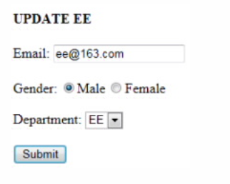

# 1.SpringMVC 概述 

- Spring 为展现层提供的基于 MVC 设计理念的优秀的Web 框架，是目前最主流的 MVC 框架之一
- Spring3.0 后全面超越 Struts2，成为最优秀的 MVC 框架
- Spring MVC 通过一套 MVC 注解，让 POJO 成为处理请求的控制器，而无须实现任何接口。
- 支持 REST 风格的 URL 请求
- 采用了松散耦合可插拔组件结构，比其他 MVC 框架更具扩展性和灵活性


# 2.SpringMVC 的 HelloWorld 

## 2.1 引入相关的jar包

```xml
		<dependency>
            <groupId>junit</groupId>
            <artifactId>junit</artifactId>
            <version>4.13</version>
        </dependency>
        <!--SpringMvc的依赖包-->
        <dependency>
            <groupId>commons-logging</groupId>
            <artifactId>commons-logging</artifactId>
            <version>1.2</version>
        </dependency>
        <dependency>
            <groupId>org.springframework</groupId>
            <artifactId>spring-aop</artifactId>
            <version>4.3.22.RELEASE</version>
        </dependency>
        <dependency>
            <groupId>org.springframework</groupId>
            <artifactId>spring-beans</artifactId>
            <version>4.3.22.RELEASE</version>
        </dependency>
        <dependency>
            <groupId>org.springframework</groupId>
            <artifactId>spring-context</artifactId>
            <version>4.3.22.RELEASE</version>
        </dependency>
        <dependency>
            <groupId>org.springframework</groupId>
            <artifactId>spring-core</artifactId>
            <version>4.3.22.RELEASE</version>
        </dependency>
        <dependency>
            <groupId>org.springframework</groupId>
            <artifactId>spring-expression</artifactId>
            <version>4.3.22.RELEASE</version>
        </dependency>
        <dependency>
            <groupId>org.springframework</groupId>
            <artifactId>spring-web</artifactId>
            <version>4.3.22.RELEASE</version>
        </dependency>
        <dependency>
            <groupId>org.springframework</groupId>
            <artifactId>spring-webmvc</artifactId>
            <version>4.3.22.RELEASE</version>
        </dependency>
```

## 2.2 在web.xml文件中配置DispatcherServlet

```xml
<?xml version="1.0" encoding="UTF-8"?>
<web-app version="2.4"
         xmlns="http://java.sun.com/xml/ns/j2ee"
         xmlns:xsi="http://www.w3.org/2001/XMLSchema-instance"
         xsi:schemaLocation="http://java.sun.com/xml/ns/j2ee http://java.sun.com/xml/ns/j2ee/web-app_2_4.xsd">
  <!--配置DispatcherServlet-->
  <servlet>
    <servlet-name>dispatcherServlet</servlet-name>
    <servlet-class>org.springframework.web.servlet.DispatcherServlet</servlet-class>
    <!--配置DispatcherServlet的一个初始化参数：配置SpringMvc配置文件的位置和名称-->
    <!--
    实际上也可以不通过contextConfigLocation来配置SPringMVc的配置文件，而使用默认的，
    默认的配置文件为：/WEB-INF/<servlet-name>-servlet.xml
	创建/WEB-INF/dispatcherServlet-servlet.xml.init-param相关配置即可省略
    -->
    <init-param>
      <param-name>contextConfigLocation</param-name>
      <param-value>classpath:applicationContext.xml</param-value>
    </init-param>
    <load-on-startup>1</load-on-startup>
  </servlet>
  <!---->
  <servlet-mapping>
    <servlet-name>dispatcherServlet</servlet-name>
    <url-pattern>/</url-pattern>
  </servlet-mapping>
</web-app>
        
```


## 2.3 加入SpringMvc配置文件(实际上是Spring的配置文件)

```xml
<?xml version="1.0" encoding="UTF-8"?>
<beans xmlns="http://www.springframework.org/schema/beans"
       xmlns:xsi="http://www.w3.org/2001/XMLSchema-instance"
       xmlns:context="http://www.springframework.org/schema/context"
       xsi:schemaLocation="http://www.springframework.org/schema/beans http://www.springframework.org/schema/beans/spring-beans.xsd http://www.springframework.org/schema/context http://www.springframework.org/schema/context/spring-context.xsd">
    <!--配置扫描-->
    <context:component-scan base-package="com.atguigu"/>
    <!--配置视图解析器:将handler返回值解析为实际的物理视图-->
    <bean class="org.springframework.web.servlet.view.InternalResourceViewResolver">
        <property name="prefix" value="/WEB-INF/views/"/>
        <property name="suffix" value=".jsp"/>
    </bean>
</beans>
```

## 2.4 编写处理请求的控制器，并标识为处理器

```java
package com.atguigu.handlers;

import org.springframework.stereotype.Controller;
import org.springframework.web.bind.annotation.RequestMapping;

@Controller
public class HelloWorld {

    /*
    * 1.使用@RequestMapping 注解来映射请求的URL
    * 2.返回值会通过视图解析器解析为实际的物理视图,对于InternalResourceViewResolver视图解析器，会做如下解析：
    *   通过prefix+返回值+suffix 这样的方式得到的是实际的物理视图。
    *
    * */
    @RequestMapping("/helloWorld")
    public String helloWorld(){
        System.out.println("Hello World!");
        return "success";
    }
}

```

## 2.5 编写视图

index.jsp

```jsp
<%@ page contentType="text/html;charset=UTF-8" language="java" %>
<html>
<head>
    <title>Title</title>
</head>
<body>
    <a href="helloWorld">HelloWorld!</a>
</body>
</html>

```

src\main\webapp\WEB-INF\views下创建success.jsp

```jsp
<%@ page contentType="text/html;charset=UTF-8" language="java" %>
<html>
<head>
    <title>Title</title>
</head>
<body>
    <h4>Success!</h4>
</body>
</html>
```


# 3.使用 @ RequestMapping 映射请求

标准的请求报文头：


## 3.1 RequestMapping的常见属性

@RequestMapping 除了可以使用请求 URL 映射请求外,还可以使用请求方法、请求参数及请求头映射请求
@RequestMapping 的 value、method、params 及 heads分别表示请求 URL、请求方法、请求参数及请求头的映射条件，他们之间是与的关系，联合使用多个条件可让请求映射更加精确化。

params和 headers支持简单的表达式：

```markdown
param1: 表示请求必须包含名为 param1 的请求参数
!param1: 表示请求不能包含名为 param1 的请求参数
param1 != value1: 表示请求包含名为 param1 的请求参数，但其值不能为 value1
{“param1=value1”, “param2”}: 请求必须包含名为 param1 和param2的两个请求参数，且 param1 参数的值必须为 value1
```


Spring MVC 使用 @RequestMapping 注解为控制器指定可以处理哪些 URL 请求
在控制器的类定义及方法定义处都可标注

```
@RequestMapping
类定义处：提供初步的请求映射信息。相对于 WEB 应用的根目录
方法处：提供进一步的细分映射信息。相对于类定义处的 URL。若类定义处未标注 @RequestMapping，则方法处标记的 URL 相对于WEB 应用的根目录
```

DispatcherServlet 截获请求后，就通过控制器上@RequestMapping 提供的映射信息确定请求所对应的处理方法。

```JAVA
package com.atguigu.handlers;

import org.springframework.stereotype.Controller;
import org.springframework.web.bind.annotation.RequestMapping;

@RequestMapping("/springmvc")
@Controller
public class SpringMvcTest {
    private static final String SUCCESS="success";
    /*
    * RequestMapping除了修饰方法，还可以来修饰类
    * */
    @RequestMapping("/testRequestMapping")
    public String testRequestMapping(){
        System.out.println("testRequestMapping");
        return SUCCESS;
    }
}

```


创建JSP页面元素：

```jsp
<a href="springmvc/testParamsAndHeaders?username=ynf&age=11">testParamsAndHeaders</a>
```


创建控制器：

```java
package com.atguigu.handlers;

import org.springframework.stereotype.Controller;
import org.springframework.web.bind.annotation.RequestMapping;
import org.springframework.web.bind.annotation.RequestMethod;

@RequestMapping("/springmvc")
@Controller
public class SpringMvcTest {
    private static final String SUCCESS="success";
    /*了解：可以使用params和headers来更加精确的映射请求，params和headers支持简单的表达式。
    * */
    @RequestMapping(value = "/testParamsAndHeaders",
            params = {"username","age!=10"},
            headers = {"Accept-Language=zh-CN,zh;q=0.8,zh-TW;q=0.7,zh-HK;q=0.5,en-US;q=0.3,en;q=0.2"})
    public String testParamsAndHeaders(){
        System.out.println("testParamsAndHeaders   ");
        return SUCCESS;
    }   
}
```

## 3.2 RequestMapping支持通配符

Ant 风格资源地址支持 3 种匹配符：

```java
?：匹配文件名中的一个字符
*：匹配文件名中的任意字符
**：** 匹配多层路径
```

RequestMapping还支持Ant风格的url

```java
/user/*/createUser: 匹配/user/aaa/createUser、/user/bbb/createUser 等 URL
/user/**/createUser: 匹配/user/createUser、/user/aaa/bbb/createUser 等 URL
/user/createUser??: 匹配/user/createUseraa、/user/createUserbb 等 URL
```

创建JSP元素：

```jsp
    <form action="springmvc/aaa/bbb/testMethod" method="post">
        <input type="submit" value="提交">
    </form>

    <form action="springmvc/aaa/testMethod" method="post">
        <input type="submit" value="提交">
    </form>

    <form action="springmvc/testMethod11" method="post">
        <input type="submit" value="提交">
    </form>

```

创建控制器方法：

```java
    @RequestMapping(value = "/**/testMethod",method = RequestMethod.POST)
    public String testMethod(){
        System.out.println("testMethod   ");
        return SUCCESS;
    }

    @RequestMapping(value = "/*/testMethod",method = RequestMethod.POST)
    public String testMethod(){
        System.out.println("testMethod   ");
        return SUCCESS;
    }

    @RequestMapping(value = "/testMethod??",method = RequestMethod.POST)
    public String testMethod(){
        System.out.println("testMethod   ");
        return SUCCESS;
    }
```

## 3.3 PathVariable 映射 URL 绑定的占位符

**@PathVariable 映射 URL 绑定的占位符**
带占位符的 URL 是 Spring3.0 新增的功能，该功能在SpringMVC 向 REST 目标挺进发展过程中具有里程碑的意义
通过 @PathVariable 可以将 URL 中占位符参数绑定到控制器处理方法的入参中：URL 中的 {xxx} 占位符可以通过@PathVariable("xxx") 绑定到操作方法的入参中。

创建JSP元素：

```jsp
  <a href="springmvc/delete/10">删除10</a><br/>
```

创建控制器方法：

```java
package com.atguigu.handlers;

import org.springframework.stereotype.Controller;
import org.springframework.web.bind.annotation.PathVariable;
import org.springframework.web.bind.annotation.RequestMapping;
import org.springframework.web.bind.annotation.RequestMethod;
import org.springframework.web.servlet.view.InternalResourceViewResolver;

@RequestMapping("/springmvc")
@Controller
public class SpringMvcTest {
    private static final String SUCCESS="success";

    @RequestMapping(value = "/delete/{id}")
    public String delete(@PathVariable Integer id){
        System.out.println("delete value is"+id);
        return SUCCESS;
    }
}
```


**REST：**即 Representational State Transfer。（资源）表现层状态转化。是目前最流行的一种互联网软件架构。它结构清晰、符合标准、易于理解、扩展方便，
所以正得到越来越多网站的采用。
**资源（Resources）：**网络上的一个实体，或者说是网络上的一个具体信息。它可以是一段文本、一张图片、一首歌曲、一种服务，总之就是一个具体的存在。
可以用一个URI（统一资源定位符）指向它，每种资源对应一个特定的 URI 。要获取这个资源，访问它的URI就可以，因此 URI 即为每一个资源的独一无二的识
别符。
**表现层（Representation）：**把资源具体呈现出来的形式，叫做它的表现层（Representation）。比如，文本可以用 txt 格式表现，也可以用 HTML 格
式、XML 格式、JSON 格式表现，甚至可以采用二进制格式。
**状态转化（State Transfer）：**每发出一个请求，就代表了客户端和服务器的一次交互过程。HTTP协议，是一个无状态协议，即所有的状态都保存在服务器
端。因此，如果客户端想要操作服务器，必须通过某种手段，让服务器端发生“状态转化”（State Transfer）。而这种转化是建立在表现层之上的，所以就是 “
表现层状态转化”。具体说，就是 HTTP 协议里面，四个表示操作方式的动词：`GET、POST、PUT、DELETE`。它们分别对应四种基本操作：GET 用来获取资源，POST 用来新建资源，PUT 用来更新资源，DELETE 用来删除资源。

创建JSP页面：

```java
<%@ page contentType="text/html;charset=UTF-8" language="java" %>
<html>
<head>
    <title>Title</title>
</head>
<body>
    <form action="springmvc/testMethod" method="post">
        <input type="submit" value="提交">
    </form>
    <a href="helloWorld">HelloWorld!</a><br/>
    <a href="springmvc/testRequestMapping">testRequestMapping</a>
</body>
</html>

```

创建控制器：

```java
package com.atguigu.handlers;

import org.springframework.stereotype.Controller;
import org.springframework.web.bind.annotation.RequestMapping;
import org.springframework.web.bind.annotation.RequestMethod;

@RequestMapping("/springmvc")
@Controller
public class SpringMvcTest {
    private static final String SUCCESS="success";
    /*
    * 常用：使用method属性来指定请求方式
    * */
    @RequestMapping(value = "/testMethod",method = RequestMethod.POST)
    public String testMethod(){
        System.out.println("testMethod   ");
        return SUCCESS;
    }
}
```

==HiddenHttpMethodFilter==：浏览器 form 表单只支持GET与 POST 请求，而DELETE、PUT 等 method 并不支持，Spring3.0添加了一个过滤器，可以将这些请求转换为标准的 http 方法，使得支持 GET、POST、PUT 与DELETE 请求。

**Rest示例：**

```markdown
示例：
/order/1 HTTP GET ：得到 id = 1 的 order
/order/1 HTTP DELETE：删除 id = 1的 order
/order/1 HTTP PUT：更新id = 1的 order
/order HTTP POST：新增 order –
```

web.xml中注册==HiddenHttpMethodFilter==:

```xml
  <filter>
    <filter-name>forwardedHttpMethodFilter</filter-name>
    <filter-class>com.atguigu.filter.ForwardedHttpMethodFilter</filter-class>
  </filter>
  <filter-mapping>
    <filter-name>forwardedHttpMethodFilter</filter-name>
    <url-pattern>*.jsp</url-pattern>
    <dispatcher>FORWARD</dispatcher>
  </filter-mapping>
```

创建JSP页面元素：

```jsp
<a href="springmvc/testRest/1">testRestGET</a><br/>

    <form action="springmvc/testRest" method="post">
        <input type="submit" value="testRestPOST">
    </form><br/>

    <form action="springmvc/testRest/1" method="post">
        <input type="hidden" name="_method" value="PUT">
        <input type="submit" value="testRestPUT">
    </form><br/>

    <form action="springmvc/testRest/1" method="post">
        <input type="hidden" name="_method" value="DELETE">
        <input type="submit" value="testRestDELETE">
    </form><br/>
```

创建控制器对应方法：

```java
package com.atguigu.handlers;

import org.springframework.stereotype.Controller;
import org.springframework.web.bind.annotation.PathVariable;
import org.springframework.web.bind.annotation.RequestMapping;
import org.springframework.web.bind.annotation.RequestMethod;
import org.springframework.web.servlet.view.InternalResourceViewResolver;

@RequestMapping("/springmvc")
@Controller
public class SpringMvcTest {
    private static final String SUCCESS="success";
    /*
    * Rest风格的URL:
    * 以增删改查为例：
    * 新增：/order/ POST
    * 修改: /order/1 PUT
    * 获取：/order/1 GET
    * 删除：/order/1 DELETE
    *
    * 如何发送PUT请求和DELETE请求？
    * 1.需要配置HIddenHttpMethodFilter
    * 2.需要发送POST请求
    * 3.需要发送POST请求时携带一个name="_method"的隐藏域，值为DELETE或PUT
    * */
    @RequestMapping(value = "/testRest/{id}",method = RequestMethod.GET)
    public String testRestGET(@PathVariable Integer id){
        System.out.println("testRestGET----"+id);
        return SUCCESS;
    }
    @RequestMapping(value = "/testRest",method = RequestMethod.POST)
    public String testRestPOST(){
        System.out.println("testRestPOST");
        return SUCCESS;
    }
    @RequestMapping(value = "/testRest/{id}",method = RequestMethod.PUT)
    public String testRestPUT(@PathVariable Integer id){
        System.out.println("testRestPUT----"+id);
        return SUCCESS;
    }
    @RequestMapping(value = "/testRest/{id}",method = RequestMethod.DELETE)
    public String testRestDELETE(@PathVariable Integer id){
        System.out.println("testRestDELETE----"+id);
        return SUCCESS;
    }
}

```

发现问题：从前端页面能访问到控制器对应方法，但是无法返回到success.jsp页面。

创建过滤器：

```java
package com.atguigu.filter;


import javax.servlet.*;
import javax.servlet.http.HttpServletRequest;
import javax.servlet.http.HttpServletRequestWrapper;
import javax.servlet.http.HttpServletResponse;
import java.io.IOException;
import java.util.Arrays;
import java.util.Collections;
import java.util.List;

public class ForwardedHttpMethodFilter implements Filter {
    private static final List<String> ALLOWED_METHODS = Collections.unmodifiableList(Arrays.asList("PUT", "DELETE", "PATCH"));

    public void init(FilterConfig filterConfig) throws ServletException {

    }

    public void doFilter(ServletRequest request, ServletResponse response, FilterChain chain) throws IOException, ServletException {
        if (!(request instanceof HttpServletRequest) || !(response instanceof HttpServletResponse)) {
            throw new ServletException("HttpMethodFilter just supports HTTP requests");
        }

        HttpServletRequest httpRequest = (HttpServletRequest) request;
        HttpServletResponse httpResponse = (HttpServletResponse) response;

        if (ALLOWED_METHODS.contains(httpRequest.getMethod())
                && httpRequest.getAttribute("javax.servlet.error.exception") == null) {
            httpRequest = new ForwradedHttpMethodRequestWrapper(httpRequest);
        }
        chain.doFilter(httpRequest, httpResponse);
    }

    public void destroy() {

    }

    private static class ForwradedHttpMethodRequestWrapper extends HttpServletRequestWrapper {

        public ForwradedHttpMethodRequestWrapper(HttpServletRequest request) {
            super(request);
        }

        @Override
        public String getMethod() {
            return "POST";
        }
    }
}


```

web.xml文件中注册：

```xml
  <filter>
    <filter-name>forwardedHttpMethodFilter</filter-name>
    <filter-class>com.atguigu.filter.ForwardedHttpMethodFilter</filter-class>
  </filter>
  <filter-mapping>
    <filter-name>forwardedHttpMethodFilter</filter-name>
    <url-pattern>*.jsp</url-pattern>
    <dispatcher>FORWARD</dispatcher>
  </filter-mapping>
```


# 4.映射请求参数

Spring MVC 通过分析处理方法的签名，将 HTTP 请求信息绑定到处理方法的相应人参中。
Spring MVC 对控制器处理方法签名的限制是很宽松的，几乎可以按喜欢的任何方式对方法进行签名。必要时可以对方法及方法入参标注相应的注解（
@PathVariable、@RequestParam、@RequestHeader 等）、Spring MVC 框架会将 HTTP 请求的信息绑定到相应的方法入参中，并根据方法的返回值类型做出相应的后续处理。

## 4.1 使用RequetParam绑定请求参数值

在处理方法入参处使用@RequestParam可以把请求参数传递给请求方法

属性：

- value:参数名

- required:是否必须。默认为true,表示请求参数中必须包含对应的参数，若不存在，将抛出异常。

- defaultValue:请求参数的默认值

  

示例：

前端页面添加元素：

```jsp
<a href="springmvc/testRequestParam?username=ynf&age=11">testRequestParam</a><br/>
```

控制器中添加方法：

```java
  /*
    * RequestParam来映射请求参数
    * value值及请求参数的值
    * required:该参数值是否必须，默认是true
    * defaultValue:请求参数的默认值
    * */
    @RequestMapping(value = "/testRequestParam")
    public String testRequestParam(@RequestParam(value = "username",required = false) String un,@RequestParam(value = "age") Integer age){
        System.out.printf("testRequestParam username="+un+",password="+age);
        return SUCCESS;
    }
```


## 4.2使用@RequestHeader绑定请求报文头的属性值。

请求头包含了若干个属性，服务器可据此获知客户端的信息，通过@RequestHeader即可将请求头中的属性值绑定到处理方法的入参中。

示例：

前端页面添加元素：

```jsp
<a href="springmvc/testRequestHeader?username=ynf&age=11">testRequestHeader</a><br/>
```

控制器中添加方法：

```java
/*
    * 映射请求头信息
    * 用法同@RequestParam
    * 使用较少
    * */
    @RequestMapping("/testRequestHeader")
    public String testRequestHeader(@RequestHeader("Accept-Language") String al){
        System.out.println("testRequestHeader: Accept-Language="+al);
        return SUCCESS;
    }
```


## 4.3 使用 @CookieValue 绑定请求中的 Cookie 值

@CookieValue 可让处理方法入参绑定某个 Cookie 值

示例：

前端页面添加元素：

```jsp
 <a href="springmvc/testCookieValue?username=ynf&age=11">testCookieValue</a><br/>
```

控制器中添加方法：

```java
 /*
    * 了解：
    * @CookieValue:映射一个Cookie值，属性同@RequestParam
    * */
    @RequestMapping("/testCookieValue")
    public String testCookieValue(@CookieValue("JSESSIONID") String id){
        System.out.println("testCookieValue: JSESSIONID="+id);
        return SUCCESS;
    }
```


## 4.4 使用 POJO 对象绑定请求参数值

Spring MVC 会按请求参数名和 POJO 属性名进行自动匹配，自动为该对象填充属性值。支持级联属性。如：dept.deptId、dept.address.tel 等

示例：

前端页面添加元素：

```jsp
 <form action="springmvc/testPojo" method="post"><br/>
        username:<input name="username" type="text"><br/>
        password:<input name="password" type="password"><br/>
        email:<input name="email" type="text"><br/>
        age:<input name="age" type="text"/><br/>
        province:<input name="address.province" type="text"><br/>
        city:<input name="address.city" type="text"><br/>
        <input type="submit" value="submit">
    </form>
```

创建对应的实体类：

```java
package com.atguigu.bean;

public class Person {
    private String username;
    private String password;
    private String email;
    private Integer age;
    private Address address;

    public String getUsername() {
        return username;
    }

    public void setUsername(String username) {
        this.username = username;
    }

    public String getPassword() {
        return password;
    }

    public void setPassword(String password) {
        this.password = password;
    }

    public String getEmail() {
        return email;
    }

    public void setEmail(String email) {
        this.email = email;
    }

    public Integer getAge() {
        return age;
    }

    public void setAge(Integer age) {
        this.age = age;
    }

    public Address getAddress() {
        return address;
    }

    public void setAddress(Address address) {
        this.address = address;
    }

    @Override
    public String toString() {
        return "Person{" +
                "username='" + username + '\'' +
                ", password='" + password + '\'' +
                ", email='" + email + '\'' +
                ", age=" + age +
                ", address=" + address +
                '}';
    }
}

```


```java
package com.atguigu.bean;

public class Address {
    private String province;
    private String city;

    public String getProvince() {
        return province;
    }

    public void setProvince(String province) {
        this.province = province;
    }

    public String getCity() {
        return city;
    }

    public void setCity(String city) {
        this.city = city;
    }

    @Override
    public String toString() {
        return "Address{" +
                "province='" + province + '\'' +
                ", city='" + city + '\'' +
                '}';
    }
}

```


控制器中添加对应方法：

```java
    @RequestMapping("/testPojo")
    public String testPojo(Person person){
        System.out.println("testPojo: "+person);
        return SUCCESS;
    }
```


## 4.5使用Servlet API作为入参

SpringMvc的Handler方法可以接受哪些ServletAPI类型的参数？

```text
HttpServletRequest
HttpServletResponse
HttpSession
java.security.Principal
Locale
InputStream
OutputStream
Reader
Writer
```

示例：

前端页面添加元素：

```jsp
 <a href="springmvc/testRequestApi?username=ynf&age=11">testRequestApi</a><br/>
```

控制器中添加方法：

```java
 /*
    * 使用Servlet原生Api作为目标方法的参数
    * */
    @RequestMapping("/testRequestApi")
    public String testRequestApi(HttpServletRequest request, HttpServletResponse response, Writer writer){
        System.out.println("testRequestApi-----request=:"+request+", response="+response+",writer:="+writer);
        return SUCCESS;
    }
```


# 5.处理模型数据 

SpringMvc提供了一下几种途径输出模型数据：

- ModelAndView:处理方法返回值类型为ModelAndView时，方法体即可通过该对象添加模型数据。
- Map及Model:入参为org.springframeswork.ui.Model,org.springframework.ui.ModelMap或java.util.map时，处理方法返回时，Map中的数据会自动添加到模型中。
- SessionAttribute:将模型中的某个属性，暂存到HttpSession中，以便多个请求之间可以共享这个属性。
- ModelAttribute:方法入参标注该注解后，入参的对象就会放到数据模型中。

## 5.1 ModelAndView

控制器处理方法的返回值如果是ModelAndView,则其既包含视图信息，也包含模型数据信息。

添加模型数据：

- ModelAndView addObject(String attributeName.Object attributeValue)
- ModelAndView addAllObject(Map<String,?> modelMap)

设置视图：

- void setView(View view)
- void setViewName(String viewName)

示例：

请求页面添加元素：

```jsp
<a href="springmvc/testModelAndView?username=ynf&age=11">testModelAndView</a><br/>
```

结果页面添加元素：

```jsp
username:${requestScope.username}
```

控制器中添加对应方法：

```java
 /*
    * 目标方法的返回值可以是ModelAndView类型
    * 其中可以包含视图和模型信息
    * SpringMvc会把modelAndView中的模型数据放在request域对象中
    * */
    @RequestMapping("/testModelAndView")
    public ModelAndView testModelAndView(ModelAndView modelAndView){
        System.out.println("testModelAndView ---");
        //添加模型数据到ModelAndView中
        modelAndView.addObject("username","ynf");
        modelAndView.setViewName(SUCCESS);
        return modelAndView;
    }
```


## 5.2 Map及Model

SpringMvc在内部使用了一个org.springframework.ui.Model接口存储模型数据

具体步骤：

Spring MVC 在调用方法前会创建一个隐含的模型对象作为模型数据的存储容器。如果方法的入参为 Map 或 Model类型，Spring MVC 会将隐含模型的引用传
递给这些入参。在方法体内，开发者可以通过这个入参对象访问到模型中的所有数据，也可以向模型中添加新的属性数据。


示例：

请求页面添加元素：

```jsp
<a href="springmvc/testModel?username=ynf&age=11">testModel</a><br/>
<a href="springmvc/testMap?username=ynf&age=11">testMap</a><br/>
```

结果页面添加元素：

```jsp
username:${requestScope.username}
```

控制器中添加对应方法：

```java
//SpringMvc会把Map中的模型数据放在request域对象中
    @RequestMapping("/testMap")
    public String testMap(Map map){//实际上可以是Model类型或者ModelMap类型的参数
        System.out.println("testModelAndView ---");
        //添加模型数据到Map中
        map.put("username","ynf");
        return SUCCESS;
    }
    //SpringMvc会把Model中的模型数据放在request域对象中
    @RequestMapping("/testModel")
    public String testModel(Model model){//实际上可以是Model类型或者ModelMap类型的参数
        System.out.println("testModelAndView ---");
        //添加模型数据到Model中
        model.addAttribute("username","ynf");
        return SUCCESS;
    }
```


## 5.3 SessionAttributes

若希望在多个请求之间共用某个模型属性数据，则可以在控制器类上标注一个 @SessionAttributes, Spring MVC 将在模型中对应的属性暂存到 HttpSession 中。

@SessionAttributes 除了可以通过属性名指定需要放到会话中的属性外，还可以通过模型属性的对象类型指定哪些模型属性需要放到会话中

```java
@SessionAttributes(types=User.class) 会将隐含模型中所有类型为 User.class的属性添加到会话中。
@SessionAttributes(value={“user1”, “user2”}) 
@SessionAttributes(types={User.class, Dept.class})
@SessionAttributes(value={“user1”, “user2”},types={Dept.class})//注意：这里的value和type属性是或的关系
```

注意：该注解只能放在类的上面，而不能放在方法上。

示例：

请求页面添加元素：

```jsp
<a href="springmvc/testSessionAttribute?username=ynf&age=11">testSessionAttribute</a><br/>
```

结果页面添加元素：

```jsp
username:${sessionScope.person.getUsername()}<br/>
city:${sessionScope.address.getCity()}
```

控制器中添加对应方法：

```java
package com.atguigu.handlers;

import com.atguigu.bean.Address;
import com.atguigu.bean.Person;
import org.springframework.stereotype.Controller;
import org.springframework.ui.Model;
import org.springframework.web.bind.annotation.*;
import org.springframework.web.servlet.ModelAndView;

import javax.servlet.http.HttpServletRequest;
import javax.servlet.http.HttpServletResponse;
import java.io.Writer;
import java.util.Map;

@RequestMapping("/springmvc")
@SessionAttributes(value ={"person"},types={Address.class})
@Controller
public class SpringMvcTest {
    private static final String SUCCESS="success";
    /*
    * SessionAttributes不仅可以通过属性名指定放到Session中的属性，而且可以通过模型属性的对象类型指定哪些模型属性需要放到Session中
    * */
    @RequestMapping("/testSessionAttribute")
    public String testSessionAttribute(Map<String,Object> map){
        System.out.println("testSessionAttribute ---");
        Person person=new Person();
        person.setUsername("ynf");
        person.setPassword("123");
        Address address=new Address();
        address.setCity("卫辉");
        address.setProvince("河南");
        //添加模型数据到Map中
        map.put("person",person);
        map.put("address",address);
        return SUCCESS;
    }
}
```

## 5.4 ModelAttribute

应用场景：比如数据库中有个字段不能改，而页面上只有两个字段，上送空会吧原来的值覆盖掉。


在方法定义上使用@ModelAttribute 注解：Spring MVC在调用目标处理方法前，会先逐个调用在方法级上标注了@ModelAttribute 的方法。
在方法的入参前使用 @ModelAttribute 注解：

- 可以从隐含对象中获取隐含的模型数据中获取对象，再将请求参数绑定到对象中，再传入入参
- 将方法入参对象添加到模型中

**示例：**

请求页面添加元素：

```jsp
    <form action="springmvc/testModelAttribute" method="post">
        <input type="hidden" name="id" value="1"><br/>
        username:<input type="text" name="username"  value="ynf"><br/>
        email:<input type="text" name="email" value="976301948@qq.com"><br/>
        age:<input type="age" name="age" value="12"><br/>
        <input type="submit" value="Submit">
    </form>
```

创建实体类：

```java
package com.atguigu.bean;

public class Person {
    private Integer id;
    private String username;
    private String password;
    private String email;
    private Integer age;
    private Address address;

    public String getUsername() {
        return username;
    }

    public void setUsername(String username) {
        this.username = username;
    }

    public String getPassword() {
        return password;
    }

    public void setPassword(String password) {
        this.password = password;
    }

    public String getEmail() {
        return email;
    }

    public void setEmail(String email) {
        this.email = email;
    }

    public Integer getAge() {
        return age;
    }

    public void setAge(Integer age) {
        this.age = age;
    }

    public Address getAddress() {
        return address;
    }

    public void setAddress(Address address) {
        this.address = address;
    }

    public Integer getId() {
        return id;
    }

    public void setId(Integer id) {
        this.id = id;
    }

    public Person(Integer id, String username, String password, String email, Integer age, Address address) {
        this.id = id;
        this.username = username;
        this.password = password;
        this.email = email;
        this.age = age;
        this.address = address;
    }

    public Person() {
    }

    @Override
    public String toString() {
        return "Person{" +
                "id=" + id +
                ", username='" + username + '\'' +
                ", password='" + password + '\'' +
                ", email='" + email + '\'' +
                ", age=" + age +
                ", address=" + address +
                '}';
    }
}

```

控制器中添加对应方法：

```java
/*
    * 有ModelAttribute标记的方法，会在每个目标方法执行之前被SpringMvc调用
    ModelA
    * */
    @ModelAttribute
    public void getOldPersonData(@RequestParam("id") Integer id,Map<String,Object> map){
        if(id !=null){
            //模拟从数据库中获取对象
            Person p=new Person();
            p.setId(1);
            p.setPassword("123456");//取数据库中的数据
            System.out.println("从数据库中查询获取原始数据"+p);
            map.put("person",p);
        }
    }

    @RequestMapping("/testModelAttribute")
    public String testModelAttribute(@ModelAttribute Person person){
        System.out.println("需要修改的数据为"+person);
        return SUCCESS;
    }
```

**ModelAttribute运行流程：**

```text
Step1:执行@ModelAttribute修饰的方法：从数据库中取出对象，把对象放入到了Map中，键为person
Step2:SpringMvc从Map中取出person对象，并把表单的请求参数赋值给该Person对象的对应参数
Step3:SpringMvc把上述对象传入目标方法的参数

注意：在@ModelAttribute修饰的方法中，放入到Map是的键需要和目标方法如参类型的第一个字母小写的字符串一致。
```


**ModelAttribute源码分析**

```text
源代码分析流程：
1.通过反射调用@ModelAttribute注解修饰的方法。实际上把@ModelAttribute注解修饰的方法中，Map中的数据放在了implicitModel里
2.解析请求处理器的目标参数，实际上该目标参数来自于WebDataBinder对象的target属性
	1):创建WebDataBinder对象：
		a:确定ObjectName属性：若传入的attrName属性值为"",则ObjectName为类名第一个字母小写。
			*注意：attrName,若目标方法的POJO属性使用了@ModelAttribute来修饰，则attrName值即为@ModelAttribute的value属性值
		b:确定target属性：
		>在implicitModel中查找attrName的对应的属性值。若存在，OK。
		>若不存在，则验证当前Handler是否使用了@SessionAttributes进行修饰。则尝试从session中获取attrName所对应的属性值。
		若session中没有对应的属性值，则抛出异常。
		>若Handler没有使用@SessionAttributes进行修饰,或SessionAttributes中没有使用value值指定的key，和attrName相互匹配，则通过反射创建了POJO
		对象。
	2):SpringMvc把表单的请求参数赋给了WebDataBinder的target对应的属性。
	3):*SpringMvc会把WebDataBinder的attrName和target给到implicitModel，进而传到Request域对象中。
	4):把webDataBinder的target作为参数传递给目标方法的入参。
```

**SpringMvc确定目标方法POJO类型入参的过程：**

```text
1.确定一个key
	>若目标方法的POJO类型参数没使用@ModelAttribute作为修饰，则key为POJO类名第一个字母小写
	>若使用了@ModelAttribute来修饰，这key为@ModelAttribute注解的value属性值
2.在implicitModel中查找key对应的对象，若存在，则作为入参传入。
	>若在@ModelAttribute标记的方法中的Map中保存过，且key与1中确定的key一致，则会获取到。
3.若implicitModel中不存在key对应的对象，则检查当前的Handler是否使用@SessionAttributes注解修饰，若使用了该注解，且@SessionAttributes注解的
value属性值中包含了key,则会从HttpSession中获取key所对应的value值，若存在，则直接传入到目标方法的入参中。若不存在，这将抛出异常。
4.若Handler没有标识@SessionAttributes注解或@SessionAttributes注解的value值中不包含key,则会通过反射来创建POJO类型的参数，传入为目标方法的参数。
5.SpringMvc会把key和POJO类型的对象保存到implicitModel中，进而会保存到request域中。
```


## 5.5 由@SessionAttributes引发的异常

```java
org.springframework.web.HttpSessionRequiredException: Session attribute 'user' required - not found in session
```

如果在处理类定义处标注了@SessionAttributes(“xxx”)，则尝试从会话中获取该属性，并将其赋给该入参，然后再用请求消息填充该入参对象。如果在会话中找不到对应的属性，则抛出 `HttpSessionRequiredException` 异常

```java
//先从implicitModel中取，如果implicitModel不包含这个key,再去HttpSession中取
Object bindObject;
		if (implicitModel.containsKey(name)) {
			bindObject = implicitModel.get(name);
		}
		else if (this.methodResolver.isSessionAttribute(name, paramType)) {
			bindObject = this.sessionAttributeStore.retrieveAttribute(webRequest, name);
			if (bindObject == null) {
				raiseSessionRequiredException("Session attribute '" + name + "' required - not found in session");
			}
		}
```

如何避免@SessionAttributes引发的异常

```java
@Controller
@RequestMapping("/user")
@SessionAttributes(“user”)
public class UserController {
    //该方法会在隐含模型中添加一个名为user的模型属性
    @ModelAttribute("user")
    public User getUser(){
        User user = new User();
        return user;
    }
    @RequestMapping(value = "/handle71")
    public String handle71(@ModelAttribute(“user”) User user){
    ...
    }
    @RequestMapping(value = "/handle72")
    public String handle72(ModelMap modelMap,SessionStatus sessionStatus){
    ...
    }
}
```


# 6.视图和视图解析器

## 6.1SpringMvc视图解析流程

1. 请求处理方法执行完成后，最终返回一个ModelAndView对象，对于那些返回String,View或者ModelMap等类型的处理方法，SpringMvc也会在内部将它们组装成一个ModelAndView对象，他包含了逻辑名和模型对象的视图。

2. SpringMvc借助视图解析器(ViewResolver)得到最终的视图对象(View),最终的视图可以是JSP,也可以是Excel、JFreeChart等各种形式的视图。
3. 对于最终究竟采取哪种视图对象对模型数据进行渲染，处理器并不关心，处理器工作重点聚焦在生产模型数据的工作上，从而实现MVC的充分解耦


## 6.2 视图

视图的作用就是渲染模型数据，将模型里的数据以某种形式呈现给客户。

为了实现视图模型和具体实现技术的耦合，Spring在org.springframework.web.servlet包中定义了一个高度抽象的View接口：


视图对象由视图解析器负责实例化，由于视图是无状态的，所以他们不会有线程安全问题。


## 6.3 视图解析器

1. SpringMvc为逻辑视图名的解析提供了不同的策略，可以在SpringWEB上下文中配置一种或多种解析策略，并制定他们之间的先后顺序。每一种映射策略对一一个具体的视图解析器实现类。
2. 视图解析起的作用比较单一：将逻辑视图解析为一个具体的视图对象。
3. 所有视图解析器都必须实现ViewResolver接口


常用的视图解析器实现类：


```text
程序员可以选用一种或者混用多种视图解析器
每个视图解析器都实现了Ordered接口并开放出一个order属性，可以通过order属性指定解析器的优先顺序，order越小优先级越高
SpringMvc会按视图解析器顺序的优先顺序对逻辑视图名进行解析，直到解析成功并返回视图对象，否则将抛出ServletException异常
```

### 6.3.1 InternalResourceViewResolver

JSP是最常见的视图技术，可以使用InternalResourceViewResolver作为视图解析器：


### 6.3.2 JstlView

1. 若项目中使用了JSTL(只要是引入了相关的jar包),则SpringMvc会自动把视图由InternalResourceViewResolver转为JstlView
2. 若使用JSTL的fmt标签则需要在SpringMvc的配置文件中配置国际化资源文件
3. 若希望直接响应通过SpringMvc渲染的页面，可以使用mvc:view-controller标签实现

示例：（照着视频敲的，就是出不来效果）

1.引入jstl的相关jar包

```xml
    <!--jstl的相关jar包-->
    <dependency>
      <groupId>javax.servlet</groupId>
      <artifactId>jstl</artifactId>
      <version>1.2</version>
    </dependency>
    <dependency>
      <groupId>taglibs</groupId>
      <artifactId>standard</artifactId>
      <version>1.1.2</version>
    </dependency>
```


2.创建国际化的i18n配置文件

i18n.properties

```properties
i18n.username=UserName
i18n.password=PassWord
```

i18n_zh.properties

```properties
i18n.username=用户名
i18n.password=密码
```

注意这里有坑：properties配置文件要使用iso-8859-1的格式编码，idea中需要如下配置：


3.success页面添加jstl标签

```jsp
<%@ page contentType="text/html;charset=UTF-8" language="java" pageEncoding="UTF-8" %>
<%@ taglib prefix="fmt" uri="http://java.sun.com/jsp/jstl/fmt" %>
<html>
<head>
    <title>Title</title>
</head>
<body>
    <h4>Success!</h4>
<fmt:bundle basename="i18n">
    <fmt:message key="i18n.username"></fmt:message><br></br>
    <fmt:message key="i18n.password"></fmt:message><br></br>
</fmt:bundle>
</body>
</html>


```


4.沿用原来的helloworld控制器

5.测试发现，浏览器设置为中文，页面显示的是汉字，如果浏览器设置的是英文，页面显示的是username、password。


### 6.3.3 Excel视图

1. 若系统使用Excel展示数据列表，仅需要扩展SpringMVC提供的AbstractExcelView或AbstractJExcelView即可。实现buildExcelDocument()方法，在方法中使用模型数据对象构建Excel文档就可以了
2. AbstractExcelView基于POI API,而AbstractJExcelView是基于JExcelAPI的。
3. 视图对象需要配置IOC容器中的一个Bean,使用BeanNameViewResolver作为视图解析器即可
4. 若希望直接在浏览器中直接下载Excel文档，则可以设置响应头Content-Disposition的值为attachment;filename=xxx.xls

### 6.3.4 自定义视图

自定义视图开发步骤：

1.创建自定义视图类

```java
package com.atguigu.view;

import org.springframework.stereotype.Component;
import org.springframework.web.servlet.View;

import javax.servlet.http.HttpServletRequest;
import javax.servlet.http.HttpServletResponse;
import java.util.Map;
@Component
public class HelloView implements View {
    public String getContentType() {
        return null;
    }

    public void render(Map<String, ?> map, HttpServletRequest request, HttpServletResponse response) throws Exception {
        response.setContentType("text/html;charset=utf8");
        System.out.println("执行了render方法");
        response.getWriter().println("新视图");
    }
}

```

2.配置视图解析器

```xml
<?xml version="1.0" encoding="UTF-8"?>
<beans xmlns="http://www.springframework.org/schema/beans"
       xmlns:xsi="http://www.w3.org/2001/XMLSchema-instance"
       xmlns:context="http://www.springframework.org/schema/context"
       xmlns:mvc="http://www.springframework.org/schema/mvc"
       xsi:schemaLocation="http://www.springframework.org/schema/beans 
                           http://www.springframework.org/schema/beans/spring-beans.xsd 
                           http://www.springframework.org/schema/context 
                           http://www.springframework.org/schema/context/spring-context.xsd 
                           http://www.springframework.org/schema/mvc http://www.springframework.org/schema/mvc/spring-mvc.xsd">
    <!--配置扫描-->
    <context:component-scan base-package="com.atguigu"/>
    <!--配置视图解析器:将handler返回值解析为实际的物理视图-->
    <bean class="org.springframework.web.servlet.view.InternalResourceViewResolver">
        <property name="prefix" value="/WEB-INF/views/"/>
        <property name="suffix" value=".jsp"/>
    </bean>
    <!--配置国际化资源文件-->
    <bean id="messageSource" class="org.springframework.context.support.ResourceBundleMessageSource">
        <property name="basename" value="i18n"/>
    </bean>

    <!--配置直接转发的页面（无需经过任何的handler）-->
    <mvc:view-controller path="/success" view-name="redirect:/success"></mvc:view-controller>
    <!--在实际开发中通常需要配置mvc:annotation-driven,否则正常的请求会报404-->
    <mvc:annotation-driven></mvc:annotation-driven>

    <!-- 视图解析器都会有一个order属性，通过order属性指定视图解析器的优先级。
        order的作用是视图解析的优先级，值越小，优先级越高
    -->
    <bean class="org.springframework.web.servlet.view.BeanNameViewResolver">
        <property name="order" value="100"/>
    </bean>
</beans>
```

3.前端页面添加元素

```jsp
<a href="springmvc/testHelloView">testHelloView</a>
```


4.Handler中添加对应的方法‘

```java
    @RequestMapping("/testHelloView")
    public String testHelloView(){
        return "helloView";
    }
```


## 6.4 关于重定向

1. 一般情况下，控制器方法返回字符串类型的值会被当成逻辑视图名处理
2. 如果返回的字符串中带有forward:或redirect:前缀，SpringMvc会对他们进行特殊处理：将forward:和redirect:当成指示符，气候的字符串作为URL来处理

```java
redirect:success.jsp:会完成一个到success.jsp的重定向的操作
forward:success.jsp:会完成一个到success.jsp的转发操作   
```

1.前端页面新增元素：

```jsp
    <a href="springmvc/testForward">testForward</a><br/>
    <a href="springmvc/testRedirect">testRedirect</a><br/>
```


2.Handler中新增处理方法：

```java
package com.atguigu.handlers;

import com.atguigu.bean.Address;
import com.atguigu.bean.Person;
import org.springframework.stereotype.Controller;
import org.springframework.ui.Model;
import org.springframework.web.bind.annotation.*;
import org.springframework.web.servlet.ModelAndView;

import javax.servlet.http.HttpServletRequest;
import javax.servlet.http.HttpServletResponse;
import java.io.Writer;
import java.util.Map;

@RequestMapping("/springmvc")
@Controller
public class SpringMvcTest {
    @RequestMapping("/testForward")
    public String testForward(){
        return "forward:/WEB-INF/views/success.jsp";
    }
    @RequestMapping("/testRedirect")
    public String testRedirect(){
        /*
        * redirect的路径一定不能在WEB-INF路径下，因为redirect是相当于用户直接访问了路径，
        * 而用户不能访问WEB-INF目录下的文件，只有程序内部转发的时候才能转发到WEB-INF下的JSP。
        * */
//        return "redirect:/WEB-INF/views/success.jsp";
        return "redirect:/index.jsp";
    }    
}

```


## 6.5 配置直接转发页面

如果发送的请求不想通过controller，只想直接地跳转到目标页面，这时候就可以使用mvc:view-controller标签 在配置文件中配置:

```xml
 <!--配置直接转发的页面（无需经过任何的handler）-->
    <mvc:view-controller path="/success" view-name="success"></mvc:view-controller>
    <!--在实际开发中通常需要配置mvc:annotation-driven,否则正常的请求会报404-->
    <mvc:annotation-driven></mvc:annotation-driven>
```

```text
path=”/success” 就是你访问的路径（相当于RequestMapping(“/success”)）
view-name=”success”是你所要的视图（success.jsp,相当于return “success”） 配置了这个后对于/success请求,就会直接交给dispatcherServlet,
然后使用ViewResolver进行解析。
```

相当于以下代码:

```java
@RequestMapping(value="/hello")
public String hello(){
    return "hello";
}
```

也可以配置成重定向或者转发:

```xml
    <!--配置直接转发的页面（无需经过任何的handler）-->
    <mvc:view-controller path="/success" view-name="redirect:/success"></mvc:view-controller>
    <!--在实际开发中通常需要配置mvc:annotation-driven,否则正常的请求会报404-->
    <mvc:annotation-driven></mvc:annotation-driven>
```

相当于

```java
@RequestMapping(value="/hello")
public String hello(){
    return "redirect:/hello";
}
```

注意:

- 使用了这个标签后必须配置 `<mvc:annotation-driven />` 
   否则会造成所有的@Controller注解无法解析，导致404错误。
- 如果请求存在处理器,则这个标签对应的请求处理将不起作用。因为请求是先去找处理器处理,如果找不到才会去找这个标签配置。


# 7.RESTful CRUD

功能点：

1. 显示所有员工信息
   – URI：emps
   – 请求方式：GET
   – 显示效果  


2. 添加所有员工信息
   – 显示添加页面：
   • URI：emp
   • 请求方式：GET
   • 显示效果
   – 添加员工信息：
   • URI：emp
   • 请求方式：POST
   • 显示效果：完成添加，重定向到 list 页面。

     

3. 删除操作
   – URL：emp/{id}
   – 请求方式：DELETE
   – 删除后效果：对应记录从数据表中删除

   

4. 修改操作：lastName 不可修改！
   – 显示修改页面：
   • URI：emp/{id}
   • 请求方式：GET
   • 显示效果：回显表单。
   – 修改员工信息：
   • URI：emp
   • 请求方式：PUT
   • 显示效果：完成修改，重定向到 list 页面。  



1.创建表

```sql

```

2.表中添加原始数据

```sql

```


# 8.SpringMVC 表单标签 &处理静态资源

# 9.数据转换 & 数据格式化 & 数据校验

# 10.处理 JSON：使用 HttpMessageConverter

# 11.国际化

# 12.文件的上传

# 13.使用拦截器

# 14.异常处理

# 15.SpringMVC 运行流程 

# 16.在 Spring 的环境下使用 SpringMVC

# 17.SpringMVC 对比 Struts2 

1. SpringMvc的入口是Servet而，Struts2的入口是Filter
2. SpringMvc会稍微比Struts2快些，SpringMvc是基于方法设计的，而Struts2是基于类设计的，每次请求都会实例一个Action
3. SpringMvc使用更加简洁，开发效率SpringMvc确实比Struts2高,SpringMvc还支持JSR303,处理ajax请求更加方便。
4. Struts2的OGNL表达式使页面的开发效率相比SpringMvc更高一些。