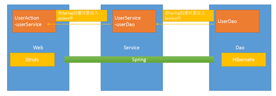
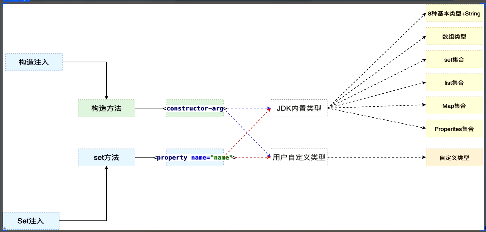
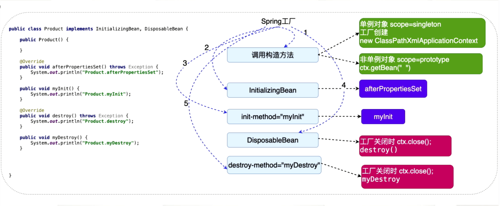

# 1.引言

## 1.1 EJB存在的问题

EJB框架是重量级的，部署在不同的容器需要实现对应的接口，在不修改代码的前提下无法实现跨容器移植。


## 1.2 Spring概述

**Spring是一个开源框架，Spring是于2003 年兴起的一个轻量级的Java 开发框架**，由Rod Johnson 在其著作Expert One-On-One J2EE Development and Design中阐述的部分理念和原型衍生而来。**它是为了解决企业应用开发的复杂性而创建的**。Spring使用基本的JavaBean来完成以前只可能由EJB完成的事情。然而，Spring的用途不仅限于服务器端的开发。从简单性、可测试性和松耦合的角度而言，任何Java应用都可以从Spring中受益简单来说，Spring是一个轻量级的控制反转（IoC）和面向切面（AOP）的容器框架。

Spring为简化企业级应用开发而生，使用 Spring 可以使简单的 JavaBean 实现以前只有 EJB 才能实现的功能.Spring 是一个 IOC(DI) 和 AOP 容器框架.具体描述 Spring:

- 轻量级：非侵入式的，基于Spring开发的应用中的对象可以不依赖于Spring的API。
- 依赖注入(DI --- dependency injection、IOC)
- 容器：Spring是一个容器，因为它包含并管理对象的生命周期
- 框架：Spring 实现了使用简单的组件配置组合成一个复杂的应用. 在 Spring 中可以使用 XML 和 Java 注解组合这些对象
- 一站式：在 IOC 和 AOP 的基础上可以整合各种企业应用的开源框架和优秀的第三方类库 （实际上 Spring 自身也提供了展现层的 SpringMVC 和 持久层的 Spring JDBC）


Spring是一个轻量级的JavaEE解决方案，整合众多优秀的设计模式。

轻量级：

- 对于运行环境是没有额外要求的（比如开源的服务器{tomcat jetty},收费{weblogic websphere}）

- 代码移植性高.。

- 不需要实现额外的接口。


JavaEE的解决方案：


整合的设计模式有：（主要整合了如下设计模式）

1. 工厂设计模式
2. 模板设计模式
3. 策略设计模式

## 1.3 Spring好处

- 方便解耦合：spring就是一个大工厂，专门负责生产bean类，可以将所有对象的创建和依赖关系维护由Spring管理
- AOP编程支持：Spring提供面向切面编程，可以方便的实现对程序进行权限拦截、运行监控等功能
- 声明式事务支持：Spring提供面向切面编程，可以方便的实现对程序进行权限拦截、运行监控等功能
- 方便程序的测试：Spring对Junit4支持，可以通过注解方便的测试Spring程序
- 方便集成各种优秀框架：Spring不排斥各种优秀的开源框架，其内部提供了对各种优秀框架的支持，如：Struts、Mybatis、Hibernate、Quartz
- 降低Java Api的使用难度：对JavaEE开发中一些难用的API（JDBC、JavaMail、远程调用WebService），都进行了封装，使这些API的应用难度大大降低

## 1.4 Spring的体系结构

Spring 框架是一个分层架构,,它包含一系列的功能要素并被分为大约20个模块。这些模块分为Core Container、Data Access/Integration、Web、AOP（Aspect Oriented Programming)、Instrumentation和测试部分,如下图所示：


## 1.5 在项目中的架构

web层：Struts,SpringMVC

dao层：Hibernate,mybatis



## 1.6 什么是设计模式

1. 广义概念：

   在面向对象的设计中，解决特定问题的经典代码

2. 狭义概念：

   GOF4人帮（面向对象领域的4个大师）所定义的23种设计模式：工厂、适配器、门面、代理、模板…….

## 1.7 工厂设计模式

### 1.7.1 什么是工厂设计模式

工厂设计模式：

​	通过工厂创建对象。

​	好处：解耦合。

```java
User uer=new User();
UserDao userDao=new UserDAOImpl();
```


2.好处：解耦合。

耦合：指代码间的强关联关系，一方改变影响到另一方。

问题：不利于代码的维护。

可简单的理解为：把接口的实现类，硬编码带程序中。

```java
UserService userService=new UserServiceImpl();
```


### 1.7.2 简单工厂

通过工厂类来创建对象，解决了调用层面的耦合，而实际上耦合装移到了工厂类中。

创建User类:

```java
package com.baizhidu.basic;

public class User {
    private String id;
    private String username;
    private String password;

    public User(String id, String username, String password) {
        this.id = id;
        this.username = username;
        this.password = password;
    }

    public User() {
    }

    public String getId() {
        return id;
    }

    public void setId(String id) {
        this.id = id;
    }

    public String getUsername() {
        return username;
    }

    public void setUsername(String username) {
        this.username = username;
    }

    public String getPassword() {
        return password;
    }

    public void setPassword(String password) {
        this.password = password;
    }
    @Override
    public String toString() {
        return "User{" +
                "id='" + id + '\'' +
                ", username='" + username + '\'' +
                ", password='" + password + '\'' +
                '}';
    }
}

```

创建UserDao类：

```java
package com.baizhidu.basic;

public interface UserDAO {
    public void save(User user);
    public void queryUserByNameAndPassword(String name,String password);
}
```


创建UserDaoImpl 类：

```java
package com.baizhidu.basic;

public class UserDAOImpl implements UserDAO {
    public void save(User user) {
        System.out.println("insert into user ="+user);
    }

    public void queryUserByNameAndPassword(String name, String password) {
        System.out.println("query user name="+name+" ,password ="+password);
    }
}
```


创建UserService 接口：

```java
package com.baizhidu.basic;

public interface UserService {
    public void register(User user);
    public void login(String username,String password);
}
```

创建UserSerivce接口的实现类：

```java
package com.baizhidu.basic;

public class UserServiceImpl implements UserService {
    private UserDAO userDAO=new UserDAOImpl();
    public void register(User user) {
        userDAO.save(user);
    }

    public void login(String username,String password){
        userDAO.queryUserByNameAndPassword(username,password);
    }
}
```

创建UserService的工厂类：

```java
package com.baizhidu.basic;

public class BeanFactory {
    public static UserService getUserService(){
        //这部分出现了耦合
        return new UserServiceImpl();
    }
}
```

测试：

```java

package com.baizhiedu;

import com.baizhidu.basic.BeanFactory;
import com.baizhidu.basic.User;
import com.baizhidu.basic.UserService;
import com.baizhidu.basic.UserServiceImpl;
import org.junit.Test;

public class TestSpring {
    /*
    用于测试工厂类进行耦合的操作
    * */
    @Test
    public void test1(){
        //UserServiceImplNew
        //UserService userService=new UserServiceImplNew();
//        UserService userService=new UserServiceImpl();
        UserService userService= BeanFactory.getUserService();//解决了调用部分的耦合
    	userService.login("ynf","123");
        User user=new User("1","ynf","123");
        userService.register(user);
    }
}

```


### 1.7.3 静态反射工厂

对象的创建方式：

1.直接调用构造方法创建对象。

```java
UserService userService=new UserSeriviceImpl();
```

2.通过反射的方式创建对象，解耦合。

```java
Class clazz=Class.forName(com.baizhidu.basic.UserDAOImpl);
UserService userService=(UserService)clazz.newInstance();
```

实现：将具体的类名放到配置文件中，类中只保留具体类的标识符。

创建静态反射工厂类：

```java
package com.baizhidu.basic;


import java.io.IOException;
import java.io.InputStream;
import java.util.Properties;

public class BeanFactory {
    private static Properties env=new Properties();
    static {
        InputStream inputStream=null;
        try {
            //1.获取IO输入流
            inputStream=BeanFactory.class.getResourceAsStream("/applicationContext.properties");
            //2.文件内容 封装Properties集合
            env.load(inputStream);
        } catch (IOException e) {
            e.printStackTrace();
        }finally {
            if(inputStream!=null){
                try {
                    inputStream.close();
                } catch (IOException e) {
                    e.printStackTrace();
                }
            }
        }
    }
    public static UserService getUserService(){
        UserService userService=null;
        try {
            Class clazz=Class.forName(env.getProperty("userService"));
            userService= (UserService) clazz.newInstance();
        } catch (ClassNotFoundException e) {
            e.printStackTrace();
        } catch (IllegalAccessException e) {
            e.printStackTrace();
        } catch (InstantiationException e) {
            e.printStackTrace();
        }
        return userService;
    }

    public static UserDAO getUserDAO(){
        UserDAO userDAO=null;
        try {
            Class clazz=Class.forName(env.getProperty("userDao"));
            userDAO= (UserDAO) clazz.newInstance();
        } catch (ClassNotFoundException e) {
            e.printStackTrace();
        } catch (IllegalAccessException e) {
            e.printStackTrace();
        } catch (InstantiationException e) {
            e.printStackTrace();
        }
        return userDAO;
    }
}
 

```

创建applicationContext.properties

```properties
userService=com.baizhidu.basic.UserServiceImpl
userDao=com.baizhidu.basic.UserDAOImpl
```

将UserSericeImpl的依赖UserDao，通过反射工厂方式解耦合

```java
package com.baizhidu.basic;

public class UserServiceImpl implements UserService {
    private UserDAO userDAO=BeanFactory.getUserDAO();//通过工厂类解Service层的耦合
    public void register(User user) {
        userDAO.save(user);
    }

    public void login(String username,String password){
        userDAO.queryUserByNameAndPassword(username,password);
    }
}
 
```

创建测试类：

```java
package com.baizhiedu;

import com.baizhidu.basic.BeanFactory;
import com.baizhidu.basic.User;
import com.baizhidu.basic.UserService;
import com.baizhidu.basic.UserServiceImpl;
import org.junit.Test;

public class TestSpring {
    /*
    用于测试工厂类进行耦合的操作
    * */
    @Test
    public void test1(){
        //UserServiceImplNew
        //UserService userService=new UserServiceImplNew();
//        UserService userService=new UserServiceImpl();
        UserService userService= BeanFactory.getUserService();//解决了调用部分的耦合
        userService.login("ynf","123");

        User user=new User("1","ynf","123");
        userService.register(user);
    }
}
```


### 1.7.4 通用工厂

问题：

1.简单工厂会存在大量的代码冗余。

![计算机生成了可选文字: public static User-Service getUserService() {  UserService userService = nun;  try {  //com.baizhiedu.basic.UserServiceImp  Class ctazz =  Class. forName(env. getProperty ( "user-service" ) ) ;  userService (User-service) clazz.newlnstance();  catch (ClassNOtFoundException e) {  e. printStackTrace();  catch (InstantiationException e) {  e. printStackTrace();  catch (IIIegaIAccessException e) {  e. printStackTrace();  return userService;  public static UserDAO getUserDAO(  UserDA0 userDA0 = nun;  try {  Class = Class.  userDAO = (UserDAO) clazz. newlnstance();  catch (ClassN0tF0undException e) {  e. printStackTrace();  catch (InstantiationException e) {  e. printStackTrace();  catch (IIIegaUccessException e) {  e. printStackTrace();  return userDAO; ](Spring笔记.assets/clip_image001-1601212574934.png)

可以优化冗余代码成通用工厂的形式：

```java
package com.baizhidu.basic;


import java.io.IOException;
import java.io.InputStream;
import java.util.Properties;

public class BeanFactory {
    private static Properties env=new Properties();
    static {
        InputStream inputStream=null;
        try {
            //1.获取IO输入流
            inputStream=BeanFactory.class.getResourceAsStream("/applicationContext.properties");
            //2.文件内容 封装Properties集合
            env.load(inputStream);
        } catch (IOException e) {
            e.printStackTrace();
        }finally {
            if(inputStream!=null){
                try {
                    inputStream.close();
                } catch (IOException e) {
                    e.printStackTrace();
                }
            }
        }
    }
    /*
    key:小配置文件中的key(可以是UserDao,也可以是UserService)
    * */
    public static Object getBean(String key){
        Object ret=null;
        Class clazz= null;
        try {
            clazz = Class.forName(env.getProperty(key));
            ret=clazz.newInstance();
        } catch (ClassNotFoundException e) {
            e.printStackTrace();
        } catch (IllegalAccessException e) {
            e.printStackTrace();
        } catch (InstantiationException e) {
            e.printStackTrace();
        }
        return ret;
    }
}

```

可以创建一切我们想要创建的对象。

### 1.7.5 通用工厂的使用方式

1. 定义类型（类）

2. 通过配置文件的配置告知工厂（applicationContext.properties）

   key=value

3. 通过工厂来获得类的对象。

```java
Object ret=BeanFactory.getBean(key);
```

## 1.8 总结

- Spring本质：工厂 

- Spring帮我们创建的工厂就是ApplicationContext,配置文件是applicationContext.xml


# 2.第一个Spring程序

## 2.1软件版本

1. JDK 1.8+

2. Maven 3.5+

3. IDEA 2018+

   Maven使用的是3.6和IDEA2019，在配合上可能会存在一些bug.

4. SpringFrameWork     5.1.4

官方网站：www.spring.io.com


## 2.2 环境搭建

**Step1:引入相关jar包：**

```xml
<!--Spring jar包-->
<dependency>
    <groupId>org.springframework</groupId>
    <artifactId>spring-context</artifactId>
    <version>5.1.4.RELEASE</version>
</dependency>
```

**Step2:创建Spring的配置文件**

**1.配置文件的放置位置**：可以是任意位置，没有硬性要求。

**2.配置文件的命名**：没有硬性要求，建议applicationContext.xml。 

**日后在应用Spring框架时**，需要进行配置文件路径的设置。

**在IDEA中创建applicationContext.xml:**

![计算机生成了可选文字: Ctrl+Alt+Shift+Insert  Copy  ea ste  Find Usages  Find in Pathm  Replace in Pathm  Ana lyze  Refactor  Add to Favorites  Reformat Code  Optimize Imports  Deletem  Build Module 'baizhi-spring5-OI'  Rebuild  Run All Tests'  Qebug All Tests'  Run All Tests' with Coverage  Ctrl  Ctrl+V  Ctrl+G  Ctrl+H  Ctrl+Alt+L  Ctrl+AIt+O  Delete  Ctrl + Shift* Fg  Ctrl+Shift+FIO  Katlin File/Class  Scratch File  Di recto ry  FXML File  HTML File  Stylesheet  ingframework</groupld>  ng-context</artifactld>  ELEASE</version>  CFML/CFC file  JavaScript File  TypeScript File  packagejson File  Katlin Script  Katlin Worksheet  OpenAPI Specification  JavaFXApplication  Edit File Templatesm  EditorConfig File  Swing UI Designer  Resource Bundle  XML Configuration File  Diagram  Google Guice  HTTP Request  .exe"  password  -'123'}  Run All Tests' with Dava Flight Recorder'  0  Create All Tests'm  Show in Explorer  Directory path  Open in Terminal  Local History  Reload from Disk  Compare Withm  Open Module Settings  Mark Directory as  Remove 80M  Open on GitHub  O Create Gistm  Diag ra ms  Convert Java File to Katlin File  JSP Tag Library Descriptor  Spring Config  Ctrl+AIt+F12  Ctrl+D  Ctrl+Alt+Shift+K ](Spring笔记.assets/clip_image001-1601213048843.png)


生成的applicationContext配置文件如下所示：

```xml
<?xml version="1.0" encoding="UTF-8"?>
<beans xmlns="http://www.springframework.org/schema/beans"
       xmlns:xsi="http://www.w3.org/2001/XMLSchema-instance"
       xsi:schemaLocation="http://www.springframework.org/schema/beans http://www.springframework.org/schema/beans/spring-beans.xsd">

</beans>
```

## 2.3 Spring的核心API

| Struct的核心API:     | Action  ActionSupport ServletActionContext |
| -------------------- | ------------------------------------------ |
| **MyBatis的核心API** | **SqlSessionFactory  SqlSession**          |

ApplicationContext是接口类型：

- 接口为了屏蔽实现的差异。
- 非web环境工厂:ClassPathXmlApplicationContext(比如，在main函数，junit中)
- web环境：XmlWebApplicationContext

所有的实现类：（选中类名，按F4）

![计算机生成了可选文字: Hierarchy: Subtypes of ApplicationContext  V Scope: All  ApplicationContext (org.springframework.context)  Config u ra bleAppl icationContext  (org.springframework.context)  AbstractApplicationContext  (org.springframework.context.support)  GenericApplica tionContext  (org.springframework.context.support)  GenericXmlApplicationContext  (org.springframework.context.support)  Sta ticApplica tionContext  (org.springframework.context.support)  GenericG roowAppl ica tionContext  (org.springframework.context.support)  A n nota tionConfigApplica tionContext  (org.springframework.context.annotation)  AbstractRefreshableApplicationContext (org.springframework.context.support)  AbstractRefresha bleConfigAppl ica tionContext  (org.springframework.context.support)  AbstractXmlApplicationContext (org.springframework.context.support)  FileSystemXmlApplicationContext  (arg. springframewark. context. support)  ClassPathXmlApplicationCantext (org.springframework.context.support) ](Spring笔记.assets/clip_image001-1601214896911.png)

这时没有XmlWebApplicationContext,需要导入Springmvc相关jar包。引入SpringMvc的jar包；

```xml
<dependency>
    <groupId>org.springframework</groupId>
    <artifactId>spring-webmvc</artifactId>
    <version>5.1.4.RELEASE</version>
</dependency>
```

![计算机生成了可选文字: hy: Subtypes of ApplicationContext  lerarc  V Scope: All  ApplicationContext (org.springframework.context)  Config u ra bleAppl icationContext  (org.springframework.context)  AbstractApplicationContext (org.springframework.context.support)  GenericApplica tionContext  (org.springframework.context.support)  GenericXmlApplicationContext (org.springframework.context.support)  Sta ticApplica tionContext  (org.springframework.context.support)  Sta ticWebAppl ica tionContext  (org.springframework.web.context.support)  GenericWebApplica tionContext  (org.springframework.web.context.support)  GenericG roowAppl ica tionContext  (org.springframework.context.support)  A n nota tionConfigApplica tionContext  (org.springframework.context.annotation)  AbstractRefreshableApplicationContext (org.springframework.context.support)  AbstractRefresha bleConfigAppl ica tionContext  (org.springframework.context.support)  AbstractXmlApplicationContext (org.springframework.context.support)  AbstractRefresha bleWebAppl ica tionContext  (org.springframework.web.context.support)  Config u ra bleWebAppl ica tionContext  (org.springframework.web.context)  GenericWebApplica tionContext  (org.springframework.web.context.support)  StaticWebApplicationContext (org.springframework.web.context.support)  AbstractRefresha bleWebAppl ica tionContext  (org.springframework.web.context.support)  WebApplicationContext (org.springframework.web.context)  Config u ra bleWebAppl ica tionContext  (org.springframework.web.context)  GenericWebApplica tionContext  (org.springframework.web.context.support)  Sta ticWebAppl ica tionCo ntext  (org.springframework.web.context.support)  AbstractRefreshableWebApplicationContext (org.springframework.web.context.support)  XmlWebApplicationContext (org.springframework.web.context.support)  GroowWebApplicationContext (org.springframework.web.context.support)  A n nota tionConfig WebAppl ica tionContext  (org.springframework.web.context.support) ](Spring笔记.assets/clip_image001-1601215074004.png)

ApplicationContext是重量级资源：

1. ApplicationContext工厂对象（主要指它的实现类）占用大量内存
2. 不会频繁的创建该对象，一个应用只会创建一个工厂对象
3. ApplicationContext一定是线程安全的，可以被多线程并发访问


## 2.4程序开发

1.创建实体类

```java
package com.baizhidu.basic;

public class Person {
}
```


2.创建ApplicationContext.xml配置文件

```xml
<?xml version="1.0" encoding="UTF-8"?>
<beans xmlns="http://www.springframework.org/schema/beans"
       xmlns:xsi="http://www.w3.org/2001/XMLSchema-instance"
       xsi:schemaLocation="http://www.springframework.org/schema/beans http://www.springframework.org/schema/beans/spring-beans.xsd">
    <!--class为完整类名，id为全局唯一标识符-->
    <bean class="com.baizhidu.basic.Person" id="person"/>
</beans>
```


3.创建工厂类

```java
@Test
public void test2(){
    ApplicationContext applicationContext=new ClassPathXmlApplicationContext("applicationContext.xml");
    Person person= (Person) applicationContext.getBean("person");
    System.out.println(person);
}
```


## 2.5细节分析

名词解释：

​	Spring工厂创建的对象叫做Bean或者组件。

Spring工厂相关的方法：

```java
@Test
    public void test3(){
        ApplicationContext applicationContext=new ClassPathXmlApplicationContext("applicationContext.xml");
        /*
        * getBean方法的重载方法：
        * getBean(String str)
        * getBean(String str,Class class)
        * getBean(Class class)
        * */
        Person person=applicationContext.getBean("person",Person.class);//通过这种方式获取Bean不需要强制类型转换
        person=applicationContext.getBean(Person.class);

        //获取Spring工厂所有Bean标签的id值
        String[] beanNames1=applicationContext.getBeanDefinitionNames();
        System.out.println(Arrays.toString(beanNames1));

        //通过类型获取Spring配置文件中，对应的id的值
        String[] beanNames2=applicationContext.getBeanNamesForType(Person.class);
        System.out.println(beanNames2);

        //用于判断是否存在对应id值的bean
        boolean flag=applicationContext.containsBeanDefinition("person");
        System.out.println(flag);

        //用于判断是否存在对应id值的bean
        boolean flag1=applicationContext.containsBean("person");
        /*
        * containsBean和containsBeanDefinition是有区别的：
        * containsBean可以判断id，也可以判断name
        * containsBeanDefinitions只能判断id
        * */
    }
```

配置文件中需要注意的细节：

**1.只配置class属性**

```xml
<bean class="com.baizhidu.basic.Person"/>
```

问题：

1.上述这种配置有没有id值？

有默认值，由Spring自动生成com.baizhidu.basic.Person#0,最后一位数字，随之递增。

2.应用场景：

如果这个bean只需要使用一次，那就可以省略id值。如果这个Bean使用多次，或者被其他bean引用，则需要设置id值。

**2.name属性**

作用:用在Spring的配置文件中，为Bean对象定义别名（小名）。

name与id的异同：

相同点：

```java
Ctx.getBean(id || name)
```

```xml
<bean id="" class=""/>等效于<bean name="" class=""/>
```


区别：

- 别名可以定义多个，别名间用逗号分隔，id只能有一个。例如：

  ```xml
   <bean class**="com.baizhidu.basic.Person"**  name**="p1,p2,p3"**  id**="person"**/>  
  ```

- xml的id属性，命名规范：必须以字母开头，有字母、数字、下划线、连字符（中划线）组成。不能以特殊字符开头，比如反斜线。而name属性没有命名要求。而xml发展到今天，已经不存在限制了。
- name会应用在特殊命名的场景下。（比如整合struts1,bean对象的命名必须以反斜线开头）

## 2.6 Spring工厂的底层实现原理（简易版）

Spring工厂底层实现原理（简易版）：Spring的工厂是可以调用对象的私有构造方法来创建对象的。


1.未来在开发过程中，是否所有的bean都由Spring工厂创建？

答：理论上来讲是的。但是是有特例的：实体对象（entity）是不会交给Spring创建的，是由持久层框架来进行创建的。


# 3.SpringIOC和DI

## 3.1SpringIOC和DI概述

**1.反转控制：（IOC Inverse Of Controller）**

控制：对成员变量赋值的控制权。

反转控制：将对成员变量赋值的控制权交由Spring的工厂和配置文件中完成。

好处：解耦合。

底层实现：工厂设计模式


 **2 依赖注入(Dependency Injection)**

注入：通过Spring工厂或配置文件，为对象的成员变量赋值。

依赖注入：当一个类需要另一个类时，就意味着依赖，一但出现依赖，就可以把另一个类作为本类的成员变量，最终通过Spring配置文件来注入。


## 3.2 Spirng配置Bean

**在 Spring 的 IOC 容器里配置 Bean**

在 xml 文件中通过 bean 节点来配置 bean 

```xml
<?xml version="1.0" encoding="UTF-8"?>
<beans xmlns="http://www.springframework.org/schema/beans"
       xmlns:xsi="http://www.w3.org/2001/XMLSchema-instance"
       xsi:schemaLocation="http://www.springframework.org/schema/beans http://www.springframework.org/schema/beans/spring-beans.xsd">
    <!--
      配置Bean
          class:bean的全类名，通过反射的方式在IOC容器中创建Bean,所以要求Bean中必须有无参构造
          id:标识容器中的bean,id唯一
      -->
    <bean id="helloWorld" class="com.atguigu.spring.beans.HelloWold">
        <property name="name" value="Spring"/>
    </bean>
</beans>
```

**id:Bean的唯一标识**

在IOC容器中必须是唯一的,若id没有指定，Spring自动将权限定性类名作为Bean的名字,比如(com.baizhidu.basic.Person#0)

**name:Bean的名字**

每个Bean可以指定多个名字，名字直接按用逗号、分号、或空格分隔。


**Spring容器**

在SpringIOC容器读取bean配置创建Bean实例之前，必须对它进行实例化，只有容器实例化后，才可以从容器里获取bean实例并使用。

Spring提供了两种类型的IOC容器实现：

1.`BeanFactory`:IOC容器的基本实现，是Spring框架的基础设施，面向Spring本身。

2.`ApplicationContext`:提供了更多的高级特性，是BeanFactory的子接口。

3.总结：ApplicationContext面向使用Spring框架的开发者，几乎所有的应用场合都直接使用ApplicationContext而非底层的BeanFactory，无论用何种方式，配置文件是相同的。

## 3.3注入

### 3.3.1什么是注入

1.什么是注入？

​	通过Spring工厂及配置文件，为所创建的对象的成员变量赋值。

2.为什么需要注入？

​	通过编码的方式为成员变量进行赋值，存在耦合。


3.注入的开发步骤：

1. 类的成员变量提供set、get方法。
2. 配置Spring的配置文件。

```xml
<bean class="com.baizhidu.basic.Person" name="p1,p2,p3" id="person">
    <property name="id">
        <value>1</value>
    </property>
    <property name="name">
        <value>ynf</value>
    </property>
</bean>
```

4.注入的好处：

​	解耦和。（修改的是配置文件，不涉及重新编译，重新部署）

## 3.4 set注入

由于成员变量的类型有很多种，在property标签中，需要嵌套其他标签。例如：

```xml
<property>
	<value></value>
</property>
```

或者

```xml
<property>
	<ref></ref>
</property>
```

注入主要涉及两大类型：

1. JDK内置类型注入
2. 用户自定义类型注入


### 3.4.1 JDK内置类型注入

**String+8种基本数据类型：**

标签跟泛型有关，

| 有泛型：List<String> | 只能是value标签。            |
| -------------------- | ---------------------------- |
| 无泛型：List         | 可有value标签，可以有ref标签 |

value标签和ref标签是同级的（value能在哪儿用，ref就能在哪儿用），如果基本数据类型，则用value标签，如果是用户自定义数据类型，则使用ref标签。property标签中直接跟value。

```xml
<property name="id">
    <value>10</value>
</property>
<property name="name">
    <value>yusael</value>
</property>
```

**数组：**

```xml
<property name="emails">
    <list>
        <value>abc@qq.com</value>
        <value>123@qq.com</value>
        <value>hello@qq.com</value>
    </list>
</property>
```

**List集合:**

```xml
<property name="addresses">
    <list>
        <value>China</value>
        <value>Earth</value>
        <value>hell</value>
    </list>
</property>
```

**Set集合:**

```xml
<property name="tels">
    <set>
        <value>138xxxxxxxxxx</value>
        <value>139xxxxxxxxxx</value>
        <value>138xxxxxxxxxx</value><!--set会自动去重-->
    </set>
</property>
```

**Map集合**：

注意:key有特定的标签key,值根据类型有不同的标签，可以是value,也可以是ref。

```xml
<property name="qqs">
    <map>
        <entry>
            <key><value>hello</value></key>
            <value>12312312312</value>
        </entry>
        <entry>
            <key><value>world</value></key>
            <value>21314214214</value>
        </entry>
    </map>
</property>
 
```

**Properies类型:**

```xml
<property name="p">
    <props>
        <prop key="key1">value1</prop>
        <prop key="key2">value2</prop>
        <prop key="key3">value3</prop>
    </props>
</property>
```

**复杂的JDK类型（Date）**:

需要自定义类型转换器

### 3.4.2 自定义类型转换器

**1.类型转换器**

作用：Spring通过类型转换器把配置文件中字符串类型的数据，转换成对象中成员变量对于的类型数据，进行完成了注入。

**2.自定义类型转换器**

Spring内部有现成的类型转换器，为什么还要自定义呢？

原因：`当Spring内部没有提供特定类型的转化器时，而程序员在应用的过程中还需要使用`，那么就需要程序员自定义类型转换器了。

**编码：**

1.创建实体类Person：

```java
package com.baizhiedu.bean;

import java.util.Date;

public class Person {
    private String name;
    private Date birthDay;

    public String getName() {
        return name;
    }

    public void setName(String name) {
        this.name = name;
    }

    public Date getBirthDay() {
        return birthDay;
    }

    public void setBirthDay(Date birthDay) {
        this.birthDay = birthDay;
    }

    @Override
    public String toString() {
        return "Person{" +
                "name='" + name + '\'' +
                ", birthDay=" + birthDay +
                '}';
    }
}

```

2.创建日期类型转换器MyDateConverter(注意：这里要加上泛型，告知Spring，原始类型和目标类型)

```java
package com.baizhidu.converter;

import org.springframework.core.convert.converter.Converter;

import java.text.ParseException;
import java.text.SimpleDateFormat;
import java.util.Date;
//Converter<原始类型, 目标类型>
public class MyDateConverter implements Converter<String, Date> {
    /*
    * param:配置文件中对应的原始数据
    * return:转换好的目标值
    * */
    public Date convert(String s) {
        Date date=null;
        try {
            SimpleDateFormat sf=new SimpleDateFormat("yyyy-mm-dd");
            date=sf.parse(s);
        } catch (ParseException e) {
            e.printStackTrace();
        }
        return date;
    }
}
```

3.配置文件中添加相关配置

```xml
<?xml version="1.0" encoding="UTF-8"?>
<beans xmlns="http://www.springframework.org/schema/beans"
       xmlns:xsi="http://www.w3.org/2001/XMLSchema-instance"
       xsi:schemaLocation="http://www.springframework.org/schema/beans http://www.springframework.org/schema/beans/spring-beans.xsd">
    <!--1. 注册myDateConverter-->
    <bean id="myDateConverter" class="com.baizhidu.converter.MyDateConverter"/>
    <!--2. 注册转换器:告知Spring框架，我们所创建的MyDateConverter是一个类型转换器-->
    <bean id="conversionService" class="org.springframework.context.support.ConversionServiceFactoryBean">
        <property name="converters">
            <set>
                <ref bean="myDateConverter"/>
            </set>
        </property>
    </bean>

    <bean id="person" class="com.baizhidu.converter.Person">
        <property name="name" value="YNF"/>
        <property name="birthDay" value="1992-01-17"/>
    </bean>
</beans>
```

细节：

1. MyDateConverter中日期格式可以通过依赖注入由配置文件完成。

```java
package com.baizhidu.converter;

import org.springframework.core.convert.converter.Converter;

import java.text.ParseException;
import java.text.SimpleDateFormat;
import java.util.Date;
//Converter<原始类型, 目标类型>
public class MyDateConverter implements Converter<String, Date> {
    private String pattern;

    public String getPattern() {
        return pattern;
    }

    public void setPattern(String pattern) {
        this.pattern = pattern;
    }

    /*
    * param:配置文件中对应的原始数据
    * return:转换好的目标值
    * */
    public Date convert(String s) {
        Date date=null;
        try {
            SimpleDateFormat sf=new SimpleDateFormat(pattern);
            date=sf.parse(s);
        } catch (ParseException e) {
            e.printStackTrace();
        }
        return date;
    }
}
```


```xml
<?xml version="1.0" encoding="UTF-8"?>
<beans xmlns="http://www.springframework.org/schema/beans"
       xmlns:xsi="http://www.w3.org/2001/XMLSchema-instance"
       xsi:schemaLocation="http://www.springframework.org/schema/beans http://www.springframework.org/schema/beans/spring-beans.xsd">
    <!--1.注册bean-->
    <bean id="person" class="com.baizhiedu.bean.Person">
        <property name="name" value="ynf"/>
        <property name="birthDay" value="19920116"/>
    </bean>
    <!--2.注册MyDateConverter-->
    <bean id="myDateConverter" class="com.baizhiedu.converter.MyDateConverter">
        <property name="pattern" value="yyyymmdd"/>
    </bean>
    <!--3.添加到ConversionServiceFactoryBean的converters列表中-->
    <bean id="conversionService" class="org.springframework.context.support.ConversionServiceFactoryBean">
        <property name="converters">
            <list>
                <ref bean="myDateConverter"/>
            </list>
        </property>
    </bean>
</beans>
```


2. ConversionServiceFactoryBean的id属性只能定义为conversionService

3. Spring框架已经内置了日期类型转换器，但是它所支持的格式比较奇特（yyyy/mm/dd),而yyyy-mm-dd不支持。这样配置无需自定义转换器：

```xml
<?xml version="1.0" encoding="UTF-8"?>
<beans xmlns="http://www.springframework.org/schema/beans"
       xmlns:xsi="http://www.w3.org/2001/XMLSchema-instance"
       xsi:schemaLocation="http://www.springframework.org/schema/beans http://www.springframework.org/schema/beans/spring-beans.xsd">
    <bean id="person" class="com.baizhidu.converter.Person">
        <property name="name" value="YNF"/>
        <property name="birthDay" value="1992/01/17"/>
    </bean>
</beans>
```


### 3.4.3 用户自定义类型注入

**方式1**：

1. 为成员变量提供get set 方法
2. 配置文件中进行注入

该方式的缺点：

1. 配置文件中严重存在代码冗余
2. 被注入的对象多次创建，浪费jvm内存资源。

```xml
<bean id="userService" class="com.baizhidu.basic.UserServiceImpl">
    <property name="userDAO">
        <bean class="com.baizhidu.basic.UserDAOImpl"/>
    </property>
</bean>
```

**方式2：**

```xml
<bean id="userDAO" class="com.baizhidu.basic.UserDAOImpl"/>
<bean id="userService" class="com.baizhidu.basic.UserServiceImpl">
    <property name="userDAO">
        <ref bean="userDAO"/>
    </property>
</bean>
注意：<ref local="">从Spring4.x开始就废除了，<ref local="">和<ref bean="">基本等效，<ref local="">只能是本配置文件的bean对象，bean可以引用副容器的对象。
```

### 3.4.4 Set注入的简化写法

**1.基于属性简化：**
1.jdk内置8中基本数据类型+String

```xml
<property name="id">
    <value>1</value>
</property>
<property name="name">
    <value>ynf</value>
</property>
```

可简化为：

```xml
<property name="id" value="1"/>
<property name="name" value="ynf"/>
```

注意：value属性只能简化8种基本数据类型+String注入标签

2.用户自定义类型

```xml
<property name="userDAO" >
    <bean class="com.baizhidu.basic.UserDAOImpl"/>
</property>
```

可简化为：

```xml
<bean id="userService" class="com.baizhidu.basic.UserServiceImpl">
    <property name="userDAO" ref="userDAO"></property>
</bean>
 
```

**2.基于P命名空间简化**

jdk内置8中基本数据类型+String

```xml
<bean class="com.baizhidu.basic.Person" id="person" p:name="abc" p:id="1">
</bean>
```


用户自定义类型

```xml
<bean id="userService" class="com.baizhidu.basic.UserServiceImpl" p:userDAO-ref="userDAO">
</bean>
```


## 3.6构造注入

构造注入：Spring调用构造方法，通过Spring的配置文件给成员变量赋值。

**开发步骤：**

**1.提供有参构造：**

```java
package com.baizhidu.constructor;

public class Customer {
    private int id;
    private String name;

    public Customer(int id, String name) {
        this.id = id;
        this.name = name;
    }

    public int getId() {
        return id;
    }

    public void setId(int id) {
        this.id = id;
    }

    public String getName() {
        return name;
    }

    public void setName(String name) {
        this.name = name;
    }

    @Override
    public String toString() {
        return "Customer{" +
                "id=" + id +
                ", name='" + name + '\'' +
                '}';
    }
}

```


**2.配置文件中注入:**

```xml
<bean id="customer" class="com.baizhidu.constructor.Customer">
    <constructor-arg value="1"/>
    <constructor-arg value="ynf"/>
</bean>
 
```

注意：**constructor-arg** 顺序和构造参数要一致，数量也要和构造参数一致。

**构造方法的重载:**

1.参数个数不同:通过控制contruct-args标签的数量来区分。

 2.构造参数的个数相同时：通过在标签中引用type属性进行类型区分。

```java
package com.baizhidu.constructor;

public class Customer {
    private int id;
    private String name;

    public Customer(int id) {
        this.id = id;
    }

    public Customer(String name) {
        this.name = name;
    }

    public Customer(int id, String name) {
        this.id = id;
        this.name = name;
    }

    public int getId() {
        return id;
    }

    public void setId(int id) {
        this.id = id;
    }

    public String getName() {
        return name;
    }

    public void setName(String name) {
        this.name = name;
    }

    @Override
    public String toString() {
        return "Customer{" +
                "id=" + id +
                ", name='" + name + '\'' +
                '}';
    }
}

```


```xml
<bean id="customer" class="com.baizhidu.constructor.Customer">
    <constructor-arg value="1" type="int"/>
</bean>
```

**总结：**

未来实战中应用set注入还是构造注入更多一些呢?

答:set注入会更多，因为1.构造注入麻烦（存在重载情况）2.Spring框架底层大量使用了set注入。




## 3.7 注入的原理分析

Bean标签等效于对象的创建，property标签等价于调用它的set方法。

Spring底层通过调用对象对应属性的set方法，完成成员变量的赋值，这种方法我们也称之为set注入。

## 3.8 引入外部配置文件

把Spring配置文件中，需要经常修改的字符串信息，转移到一个更小的配置文件中。
1.Spring配置文件中有哪些经常修改的字符串？
答：比如数据库相关信息。

2.经常变换字符串，在Spring的配置文件中，直接修改。
不利于项目的维护

3.转移到一个更小的配置文件好处：（.properties）好处：利于维护

配置文件参数化的开发步骤：

 提供小的配置文件（.properties）
1.创建db.properties配置文件：

```properties
driverClassName=com.mysql.jdbc.Driver
url=jdbc:mysql://localhost:3306/db1
user=root
password=ynf
```

2.Spring配置文件与小的配置文件进行整合

3.在Spring配置文件中，通过${key}获取小配置文件中对应的值。

```xml
<?xml version="1.0" encoding="UTF-8"?>
<beans xmlns="http://www.springframework.org/schema/beans"
       xmlns:xsi="http://www.w3.org/2001/XMLSchema-instance" xmlns:p="http://www.springframework.org/schema/p"
       xmlns:context="http://www.springframework.org/schema/context"
       xsi:schemaLocation="http://www.springframework.org/schema/beans http://www.springframework.org/schema/beans/spring-beans.xsd http://www.springframework.org/schema/context http://www.springframework.org/schema/context/spring-context.xsd">

    <context:property-placeholder location="db.properties"></context:property-placeholder>
    <bean id="conn" class="com.baizhidu.factorybean.ConnectionFactoryBean">
        <property name="driverClassName" value="${driverClassName}"/>
        <property name="url" value="${url}"/>
        <property name="userName" value="${user}"/>
        <property name="password" value="${password}"/>
    </bean>
</beans>
```


# 4.Spring工厂创建对象

## 4.1 创建简单对象

1.创建实体类。

2.配置文件中完成注册。

## 4.2 创建复杂对象方式1：FactoryBean接口

**1.什么是复杂对象？**

复杂对象：不能直接通过new构造方法创建的对象。


**2.Spring工厂创建复杂对象的3种方式：**

1. FactoryBean接口
2. 实例工厂
3. 静态工厂

开发步骤：

1.引入所需的jar包。

```xml
    <dependency>
      <groupId>mysql</groupId>
      <artifactId>mysql-connector-java</artifactId>
      <version>5.1.14</version>
    </dependency>
```

2.创建实体类实现FactoryBean接口


```java
package com.baizhiedu.bean;

import org.springframework.beans.factory.FactoryBean;

import java.sql.Connection;
import java.sql.DriverManager;

public class ConnectionFactoryBean implements FactoryBean<Connection> {

    @Override
    public Connection getObject() throws Exception {
        Class.forName("com.mysql.jdbc.Driver");
        Connection connection= DriverManager.getConnection("jdbc:mysql://localhost:3306/db1","root","ynf");
        return connection;
    }

    @Override
    public Class<?> getObjectType() {
        return Connection.class;
    }

    @Override
    public boolean isSingleton() {
        return false;
    }
}

```

3.Spring配置文件中完成配置

```xml
<?xml version="1.0" encoding="UTF-8"?>
<beans xmlns="http://www.springframework.org/schema/beans"
       xmlns:xsi="http://www.w3.org/2001/XMLSchema-instance" xmlns:p="http://www.springframework.org/schema/p"
       xsi:schemaLocation="http://www.springframework.org/schema/beans http://www.springframework.org/schema/beans/spring-beans.xsd">
  <bean id="conn" class="com.baizhiedu.bean.ConnectionFactoryBean"/>
</beans>
```


Spring配置文件中添加配置

注意：配置与简单对象有区别，如果class中指定的类型是FactoryBean接口的实现类，那么通过id获得的则是这个类所创建的复杂对象。


**FactoryBean开发细节：**

1. 如果想获取FactoryBean对象,使用getBean("&id")

```java
@Test
public void test8(){
    ApplicationContext applicationContext=new ClassPathXmlApplicationContext("applicationContext.xml");
    ConnectionFactoryBean connectionFactoryBean= (ConnectionFactoryBean) applicationContext.getBean("&conn");
    System.out.println(connectionFactoryBean);//com.baizhidu.factorybean.ConnectionFactoryBean@6b1274d2
}
```

2. Tosingleton()方法：

1. 1. 返回true,只能创建一个复杂对象
   2. 返回false,每次都会新创建一个对象

2. 3. 要根据对象的特点来决定返回true还是false.比如：connection---false,SqlSessionFactory----true

3. 依赖注入的体会：把连接、用户名、密码通过Spring配置文件注入。好处：解耦合

```markdown
mysql高版本在连接创建时需要SSL证书，解决方法：在原有的url连接后面加上useSSL=false,
jdbc:mysql://localhost:3306/db1?useSSL=false
```

```java
package com.baizhidu.factorybean;

import org.springframework.beans.factory.FactoryBean;

import java.sql.Connection;
import java.sql.DriverManager;

public class ConnectionFactoryBean implements FactoryBean<Connection> {
    private String driverClassName;
    private String url;
    private String userName;
    private String password;

    public String getDriverClassName() {
        return driverClassName;
    }

    public void setDriverClassName(String driverClassName) {
        this.driverClassName = driverClassName;
    }

    public String getUrl() {
        return url;
    }

    public void setUrl(String url) {
        this.url = url;
    }

    public String getUserName() {
        return userName;
    }

    public void setUserName(String userName) {
        this.userName = userName;
    }

    public String getPassword() {
        return password;
    }

    public void setPassword(String password) {
        this.password = password;
    }

    public Connection getObject() throws Exception {
        Class.forName(driverClassName);
        Connection connection=DriverManager.getConnection(url,userName,password);
        return connection;
    }

    public Class<?> getObjectType() {
        return Connection.class;
    }

    public boolean isSingleton() {
        return true;
    }
}

```


```xml
<bean id="conn" class="com.baizhidu.factorybean.ConnectionFactoryBean">
    <property name="driverClassName" value="com.mysql.jdbc.Driver"/>
    <property name="url" value="jdbc:mysql://localhost:3306/db1?useSSL=false"/>
    <property name="userName" value="root"/>
    <property name="password" value="ynf"/>
</bean>
 
```

**FactoryBean实现原理:**
接口回调：
	1.为什么Spring规定FactoryBean接口实现并且getObject()？
	2.ctx.getBean(id)获得的是复杂对象，而没有获取FactoryBean的实现类对象？

内部运行流程：

​	通过id="conn"，获得ConnectionFactoryBean类的对象，进而通过instanceOf判断是否是FactoryBean的实现类。

​	Spring按照规定调用getObject方法,返回Connection对象


**FactoryBean总结：**
        Spring中用于创建复杂对象的一种方式，也是Spring原生提供的，后续讲解整合其他框架，大量使用FactoryBean。

## 4.3 创建复杂对象方式2：静态工厂

1.避免Spring创建的侵入。
2.整合遗留系统。
	应用场景：有现成的工厂类，且只有.class文件，没有源码。

**开发步骤：**
1.创建实例工厂类

```java
package com.baizhidu.factory;

import java.sql.Connection;
import java.sql.DriverManager;

public class ConnectionFactory {
    private String driverClassName;
    private String url;
    private String userName;
    private String password;

    public String getDriverClassName() {
        return driverClassName;
    }

    public void setDriverClassName(String driverClassName) {
        this.driverClassName = driverClassName;
    }

    public String getUrl() {
        return url;
    }

    public void setUrl(String url) {
        this.url = url;
    }

    public String getUserName() {
        return userName;
    }

    public void setUserName(String userName) {
        this.userName = userName;
    }

    public String getPassword() {
        return password;
    }

    public void setPassword(String password) {
        this.password = password;
    }

    public Connection getConnection() throws Exception {
        Class.forName(driverClassName);
        Connection connection= DriverManager.getConnection(url,userName,password);
        return connection;
    }
}

```

2.Spring配置文件中添加配置
a. 配置ConnectionFactory
b.配置Connection对象，通过factory-bean/factory-method方法产生关联。

```xml
<bean id="connectionFactory2" class="com.baizhidu.factory.ConnectionFactory">
    <property name="driverClassName" value="com.mysql.jdbc.Driver"/>
    <property name="url" value="jdbc:mysql://localhost:3306/db1?useSSL=false"/>
    <property name="userName" value="root"/>
    <property name="password" value="ynf"/>
</bean>
<bean id="conn1" class="java.sql.Connection" factory-bean="connectionFactory2" factory-method="getConnection"/>
```

## 4.4 创建复杂对象方式3：实例工厂

实例工厂：创建工厂的方法是实例方法。例如：

```java
ConnectionFactory cf=new ConnectionFactory();
```

静态工厂：创建工厂的方法是静态方法。

```java
StaticConnectionFactory.getConnection();
```

开发步骤：

1.创建工厂类。

```java
package com.baizhiedu.bean;


import java.sql.Connection;
import java.sql.DriverManager;

public class StaticConnectionFactory {
    private static String driverClassName;
    private static String url;
    private static String userName;
    private static String password;

   static {
      driverClassName="com.mysql.jdbc.Driver";
      url="jdbc:mysql://localhost:3306/db1?useSSL=false";
      userName="root";
      password="ynf";
    }

    public static Connection getConnection(){
        Connection connection=null;
        try{
           Class.forName(driverClassName);
           connection= DriverManager.getConnection(url,userName,password);
        }catch (Exception e){
            e.printStackTrace();
        }
        return connection;
    }
}

```

2.添加Spring配置（只需要配置静态工厂即可，id为要获取对象的id,class为静态工厂类，factory-method为工厂方法）

```java
<?xml version="1.0" encoding="UTF-8"?>
<beans xmlns="http://www.springframework.org/schema/beans"
       xmlns:xsi="http://www.w3.org/2001/XMLSchema-instance"
       xsi:schemaLocation="http://www.springframework.org/schema/beans http://www.springframework.org/schema/beans/spring-beans.xsd">
    <bean id="conn" class="com.baizhiedu.bean.StaticConnectionFactory" factory-method="getConnection"/>
</beans>
```

3.Spring工厂创建对象总结：


## 4.5 控制Spring创建对象的次数

**1.如何控制简单对象的创建次数？**
配置文件中：

```java
	Scope="singleton/prototype"
	singleton:只会创建一次简单对象
	Prototype:每次都会创建新的简单对象
```

**2.如何控制复杂对象的创建次数？**

```java
FactoryBean{
	Issingleton(){
		Return true;//只会创建一次复杂对象
		Return false;//每次都会创建新的复杂对象
	}
}
```

**3.为什么要控制对象的创建次数》**
好处：节省不必要的内存浪费。

什么样的对象只会被创建一次？
	1.SqlSessionFactory
	2.DAO
	3.Service

什么样的对象每次都会被创建？
	1.Connection
	2.jpa和hibernate中的session
	3.mybatis中的SqlSession
	4.Struts2中的action


## 4.6对象的生命周期

1.什么是对象的生命周期？

指的是一个对象的创建、存活、消亡的过程。


2.为什么要学习对象的生命周期？

由Spring负责对象的创建、存活、销毁，了解生命周期，有利于我们使用好Spring为我们创建的对象。


3.生命周期的3个阶段：

### 4.7.1创建阶段

- Spring工厂何时创建对象？

```xml
scope="singleton":Spring工厂创建的同时创建对象。
注意：设置scope="singleton"这种情况下，也需要在获取对象的同时创建对象可以，设置bean的属性lazy-init=true。
<bean id="product"class="com.baizhidu.life.Product"scope="singleton"lazy-init="true"/>

scope="prototype":Spring工厂获取对象的同时创建对象。
```

### 4.7.2 初始化阶段(InitializingBean||普通方法)

Spring工厂在创建对象，调用对象的初始化方法，完成相应的初始化操作。

初始化方法提供：程序员根据需求，提供初始化方法，最终完成初始化操作

初始化调用：由Spring进行调用

方式一：实现InitialingBean接口，重写afterPropertiesSet()。

1.实现InitialingBean接口

```java
package com.baizhiedu.bean;

import org.springframework.beans.factory.InitializingBean;

public class Product implements InitializingBean {
    private String name;

    public Product() {
        super();
        System.out.println("调用无参构造");
    }

    public String getName() {
        return name;
    }

    public void setName(String name) {
        this.name = name;
        System.out.println("调用set方法注入");
    }

    @Override
    public void afterPropertiesSet() throws Exception {
        System.out.println("调用afterPropertiesSet方法");
    }
}

```


2.添加Spring配置

```xml
<?xml version="1.0" encoding="UTF-8"?>
<beans xmlns="http://www.springframework.org/schema/beans"
       xmlns:xsi="http://www.w3.org/2001/XMLSchema-instance"
       xsi:schemaLocation="http://www.springframework.org/schema/beans http://www.springframework.org/schema/beans/spring-beans.xsd">
    <bean id="product" class="com.baizhiedu.bean.Product">
        <property name="name" value="123"/>
    </bean>
</beans>
```

运行结果：

```markdown
调用无参构造
调用set方法注入
调用afterPropertiesSet方法
```


方式二：对象中定义普通方法

1.创建对象

```java
package com.baizhiedu.bean;

import org.springframework.beans.factory.InitializingBean;

public class Product implements InitializingBean {
    private String name;

    public Product() {
        super();
        System.out.println("调用无参构造");
    }

    public String getName() {
        return name;
    }

    public void setName(String name) {
        this.name = name;
        System.out.println("调用set方法注入");
    }

    @Override
    public void afterPropertiesSet() throws Exception {
        System.out.println("调用afterPropertiesSet方法");
    }

    public void initMethod(){
        System.out.println("普通初始化方法");
    }
}

```


2.添加Spring配置

```xml
<?xml version="1.0" encoding="UTF-8"?>
<beans xmlns="http://www.springframework.org/schema/beans"
       xmlns:xsi="http://www.w3.org/2001/XMLSchema-instance"
       xsi:schemaLocation="http://www.springframework.org/schema/beans http://www.springframework.org/schema/beans/spring-beans.xsd">
    <bean id="product" class="com.baizhiedu.bean.Product" init-method="initMethod">
        <property name="name" value="123"/>
    </bean>
</beans>
```

运行结果：

```markdown
调用无参构造
调用set方法注入
调用afterPropertiesSet方法
普通初始化方法
```

细节分析：

1.如果一个对象即实现了InitializingBean,同时又提供了普通的初始化方法，先执行InitializingBean的afterPropertiesSet方法，再执行普通初始化方法。

2.注入一定发生在初始化操作之前

3.什么叫初始化操作？初始化一般是指资源的初始化：数据库、网络、IO等。

### 4.7.3 销毁阶段(DisposableBean||普通方法)

Spring销毁对象前会调用对象的销毁方法，完成销毁操作。

Spring什么时候销毁对象？ctx.close

销毁方法：程序员根据需求来定义销毁方法，完成销毁对象，调用由Spring工厂来完成调用。

方式1：实现DisposableBean接口，重写distory方法。

1.创建实体类，实现DisposableBean接口

```java
package com.baizhiedu.bean;

import org.springframework.beans.factory.DisposableBean;
import org.springframework.beans.factory.InitializingBean;

public class Product implements InitializingBean, DisposableBean {
    private String name;

    public Product() {
        super();
        System.out.println("调用无参构造");
    }

    public String getName() {
        return name;
    }

    public void setName(String name) {
        this.name = name;
        System.out.println("调用set方法注入");
    }

    @Override
    public void afterPropertiesSet() throws Exception {
        System.out.println("调用afterPropertiesSet方法");
    }

    public void initMethod(){
        System.out.println("普通初始化方法");
    }

    @Override
    public void destroy() throws Exception {
        System.out.println("destory方法");
    }
}

```

2.添加Spring配置。

```xml
    <bean id="product" class="com.baizhiedu.bean.Product" init-method="initMethod">
        <property name="name" value="123"/>
    </bean>
```

3.测试方法

```java
    @Test
    public void test1(){
        ClassPathXmlApplicationContext applicationContext=new ClassPathXmlApplicationContext("applicationContext.xml");
        Product product= (Product) applicationContext.getBean("product");
        applicationContext.close();
    }
```

运行结果：

```markdown
调用无参构造
调用set方法注入
调用afterPropertiesSet方法
普通初始化方法
destory方法
```


方式2：定义普通方法作为销毁方法。

1.创建实体类

```java
package com.baizhiedu.bean;

import org.springframework.beans.factory.DisposableBean;
import org.springframework.beans.factory.InitializingBean;

public class Product implements InitializingBean, DisposableBean {
    private String name;

    public Product() {
        super();
        System.out.println("调用无参构造");
    }

    public String getName() {
        return name;
    }

    public void setName(String name) {
        this.name = name;
        System.out.println("调用set方法注入");
    }

    @Override
    public void afterPropertiesSet() throws Exception {
        System.out.println("调用afterPropertiesSet方法");
    }

    public void initMethod(){
        System.out.println("普通初始化方法");
    }

    @Override
    public void destroy() throws Exception {
        System.out.println("destory方法");
    }

    public void myDestory(){
        System.out.println("my destory方法");
    }
}

```


2.添加Spring配置

```xml
    <bean id="product" class="com.baizhiedu.bean.Product" init-method="initMethod" destroy-method="myDestory">
        <property name="name" value="123"/>
    </bean>
```

3.测试类

```java
    @Test
    public void test1(){
        ClassPathXmlApplicationContext applicationContext=new ClassPathXmlApplicationContext("applicationContext.xml");
        Product product= (Product) applicationContext.getBean("product");
        applicationContext.close();
    }
```

运行结果：

```markdown
调用无参构造
调用set方法注入
调用afterPropertiesSet方法
普通初始化方法
destory方法
my destory方法
```

细节分析:

1.什么是销毁操作：主要是指资源的释放:is.close,conn.close

2.销毁方法只适用于scope="singleton"的对象。

只修改上述Spring配置

```xml
<bean id="product" class="com.baizhiedu.bean.Product" init-method="initMethod" destroy-method="myDestory" scope="prototype">
  <property name="name" value="123"/>
</bean>
```

运行结果：

```markdown
调用无参构造
调用set方法注入
调用afterPropertiesSet方法
普通初始化方法
```

对象生命周期总结：

1. 调用构造方法
2. 调用注入方法（set）
3. 调用InitializingBean的afterPropertiesSet方法
4. 调用普通初始化方法
5. 调用DisposableBean 接口的destory方法
6. 调用普通销毁方法。




## 4.7后置处理Bean(BeanPostProcessor)

BeanPostProcessor:	对Spring所创建的对象进行加工。

AOP的底层实现：

注意：

```markdown
BeanPostProcessor{
    Xxxx(){
    对象加工的代码;
    }
}

```

程序员要实现BeanPostProcessor规定的接口中的方法：

Object     postBeforeInitialization()

作用：Spring创建完成对象并进行注入，可以允许Before方法进行加工。

获取Spring创建的对象：通过方法参数

最终通过返回值交给Spring框架

 

Object     postAfterInitialization()

作用：Spring执行完对象的初始化操作后，可以运行After方法进行加工。

获取Spring创建的对象：通过方法参数

最终通过返回值交给Spring框架

实战中：很少处理Spring初始化操作，没有必要区分Before和After.只需要实现其中的一个方法即可。（postAfterInitialization）

注意：postBeforeInitialization就算不执行加工处理，也应该返回Bean对象，否则流程异常。

BeanPostProcessor开发步骤：

1.类实现BeanPostProcessor接口

```java
package com.baizhiedu.bean;

import org.springframework.beans.factory.DisposableBean;
import org.springframework.beans.factory.InitializingBean;

public class Product implements InitializingBean, DisposableBean {
    private String name;

    public Product() {
        super();
        System.out.println("调用无参构造");
    }

    public String getName() {
        return name;
    }

    public void setName(String name) {
        this.name = name;
        System.out.println("调用set方法注入");
    }

    @Override
    public void afterPropertiesSet() throws Exception {
        System.out.println("调用afterPropertiesSet方法");
    }

    public void initMethod(){
        System.out.println("普通初始化方法");
    }

    @Override
    public void destroy() throws Exception {
        System.out.println("destory方法");
    }

    public void myDestory(){
        System.out.println("my destory方法");
    }
}

```


```java
package com.baizhiedu.bean;

import org.springframework.beans.BeansException;
import org.springframework.beans.factory.config.BeanPostProcessor;

public class MyBeanPostProcessor implements BeanPostProcessor {
    @Override
    public Object postProcessBeforeInitialization(Object bean, String beanName) throws BeansException {
        if(bean instanceof Product){
            System.out.println("执行postProcessBeforeInitialization");
        }
        return bean;
    }

    @Override
    public Object postProcessAfterInitialization(Object bean, String beanName) throws BeansException {
        if(bean instanceof Product){
            System.out.println("执行postProcessAfterInitialization");
            Product product= (Product) bean;
            product.setName("123");
        }
        return bean;
    }
}


```


2.配置文件中进行配置

```xml
  <bean id="product" class="com.baizhiedu.bean.Product" init-method="initMethod" destroy-method="myDestory">
        <property name="name" value="abc"/>
    </bean>
    <bean id="myBeanPostProcessor" class="com.baizhiedu.bean.MyBeanPostProcessor"/>
```


3.测试类：

```java
    @Test
    public void test1(){
        ClassPathXmlApplicationContext applicationContext=new ClassPathXmlApplicationContext("applicationContext.xml");
        Product product= (Product) applicationContext.getBean("product");
        applicationContext.close();
    }
```

运行结果：

```markdown
调用无参构造
调用set方法注入
执行postProcessBeforeInitialization
调用afterPropertiesSet方法
普通初始化方法
执行postProcessAfterInitialization
调用set方法注入（可忽略）
destory方法
my destory方法
```


3.BeanPostProcessor注意细节

​	BeanPostProcessor会对Spring工厂中所创建的所有对象进行加工。因此需要做类型判断。

4.后置处理器运行原理分析：


# 5.代理设计模式

## 5.1代理设计模式概述

**1.为什么需要代理设计模式**

1.1问题：

在Javaee分层的开发过程中，哪层次对我们来说最重要？

DAO--------Service----------------Controller

JavaEE开发过程中，最为重要的是Service层

 

Service层中包含了哪些代码？

核心功能（几十、上百行代码）+额外功能

核心功能：

- 业务运筹

- DAO调用

额外功能：（日志、性能、事务）

- 不属于业务

- 可有可无

- 代码量相对较小

 额外功能书写在Service层中好不好？

- Service层的调用角度：需要在Service层中书写额外功能。

- 软件设计者角度：Service层中不需要额外功能

现实生活中的解决方式？

**2.代理设计模式**

1.概念：通过代理类为原始类添加额外的功能。

好处：利于原始类的维护（不会因为额外功能的改动需要去东原始类的代码）

 

2.名词解释：

1.目标类、原始类：指的是业务类（核心功能----------------业务运算、DAO调用）

2.目标方法、原始方法：指的是目标类（原始类）中提供的方法。

3.额外功能（附加功能）：日志、事务、性能。


## 5.2 静态代理

代理类=目标类（原始类）+额外功能+目标类和原始类实现相同接口

```markdown
房东-----》public interface UserService{
	M1；
	M2;
}

UserSerivceImpl implements UserService{
	M1;
	M2;
}
UserServiceProxy implements UserService{
	M1;
	M2;
}

```

静态代理为每一个原始类，手工编写一个代理类。（原始类必须有.java或.class文件）

静态代理编码：

1.创建接口

```java
package com.baizhidu.proxy;

public interface UserService {
    public void register(String username,String password);
    public boolean login(String username,String password);
}
```

2.创建原始类

```java
package com.baizhidu.proxy;

public class UserServiceImpl implements UserService {
    public void register(String username, String password) {
        System.out.println("UserName:"+username+",PassWord:"+password+" register!");
    }

    public boolean login(String username, String password) {
        return true;
    }
}
```

3.创建代理类

```java
package com.baizhidu.proxy;

public class UserServiceProxy implements UserService {
    private UserServiceImpl userService=new UserServiceImpl();

    public void register(String username, String password) {
        System.out.println("注册操作日志开始");
        userService.register(username,password);
        System.out.println("注册操作日志结束");
    }

    public boolean login(String username, String password) {
        System.out.println("登录操作开始");
        return userService.login(username,password);
    }
}
```


静态代理存在的问题

1. 静态代理的类文件过多，不利于项目的管理

2. 额外功能的维护性差：代理类中额外功能修改麻烦。（比如，修改日志打印功能，所有代理类都得动代码，操作繁琐）

## 5.3 Spring的动态代理

**1.Spring动态代理的概念：**

概念：通过代理类为原始类（目标类）添加额外功能。

好处：利于原始类的维护


**2.开发步骤：**

1.搭建开发环境：引入动态代理相关的jar包

```xml
<!--动态代理相关jar包-->
<dependency>
    <groupId>org.springframework</groupId>
    <artifactId>spring-aop</artifactId>
    <version>5.1.4.RELEASE</version>
</dependency>
<dependency>
    <groupId>org.aspectj</groupId>
    <artifactId>aspectjweaver</artifactId>
    <version>1.9.2</version>
</dependency>
<dependency>
    <groupId>org.aspectj</groupId>
    <artifactId>aspectjrt</artifactId>
    <version>1.9.2</version>
</dependency>
```


2.创建原始对象

```java
package com.baizhiedu.service;

public interface UserService {
    public void register(String username, String password);
    public void login(String username,String password);
}

```


```java
package com.baizhiedu.service;

public class UserSericeImpl implements UserService {
    @Override
    public void register(String username, String password) {
        System.out.println("UserName:"+username+",PassWord:"+password+" register!");
    }

    @Override
    public Boolean login(String username, String password) {
        return true;
    }
}

```


3.提供额外功能

MethodBeforeAdvice接口：额外的功能书写到接口的实现中，运行在元素方法执行之前运行额外功能。

```java
package com.baizhiedu.service;

import org.springframework.aop.MethodBeforeAdvice;

import java.lang.reflect.Method;

public class MyAdvice implements MethodBeforeAdvice {
    @Override
    public void before(Method method, Object[] objects, Object o) throws Throwable {
        System.out.println("MyAdvice before--------");
    }
}

```

4.定义切入点

切入点：额外功能加入的位置。

目的：有程序员根据自己的需要，绝对额外功能加入给哪个原始方法。

5.组合切入点和通知

```xml
<?xml version="1.0" encoding="UTF-8"?>
<beans xmlns="http://www.springframework.org/schema/beans"
       xmlns:xsi="http://www.w3.org/2001/XMLSchema-instance" 
       xmlns:aop="http://www.springframework.org/schema/aop"
       xsi:schemaLocation="http://www.springframework.org/schema/beans 
                           http://www.springframework.org/schema/beans/spring-beans.xsd 
                           http://www.springframework.org/schema/aop http://www.springframework.org/schema/aop/spring-aop.xsd">
    <!--注册原始类-->
    <bean id="userSerice" class="com.baizhiedu.service.UserSericeImpl"/>
    <!--注册通知类-->
    <bean id="advice" class="com.baizhiedu.service.MyAdvice"/>
    <aop:config>
        <!--定义切入点-->
        <aop:pointcut id="pointcut" expression="execution(* com.baizhiedu.service.UserSericeImpl.*(..))" />
        <!--切入点与通知类关联-->
        <aop:advisor advice-ref="advice" pointcut-ref="pointcut"/>
    </aop:config>
</beans>
```

6.调用

目标：获得Spring工厂创建的动态代理对象，并进行调用。

注意：

1.Spring工厂通过元素对象的id值获得的是代理对象

2.获得代理对象后，可以通过声明接口类型，进行对象的存储。

```java
    @Test
    public void test1(){
        ClassPathXmlApplicationContext applicationContext=new ClassPathXmlApplicationContext("applicationContext.xml");
        UserService userSerice= (UserService) applicationContext.getBean("userSerice");
        userSerice.login("123","123");
        applicationContext.close();
    }
```


**3.动态代理细节分析**

Spring创建的动态代理类在哪里？

Spring框架在运行时，通过动态字节码技术，在jvm创建，等程序结束后，会和JVM一起消失。

什么叫动态字节码技术？

通过第三方动态字节码框架，在JVM中创建对应类的字节码，进行创建对象，当虚拟机结束，动态字节码跟着消失。


结论：动态代理不需要定义类文件，都是在JVM运行过程中创建的，所以动态代理不会造成类文件过多，不利于项目管理。

4.**动态代理编程简化代理开发**

在额外功能不变的情况下，创建其他类的代理对象时，只需要知道其他类的原始对象即可。

## 5.4 额外功能详解

### 5.4.1 MethodBeforeAdvice

```java
/*
* Method:额外功能所增加给的那个原始方法。比如login、register
* Object[]:额外功能所增加给的那个原始方法的参数。
* Object: 额外功能所增加给的那个原始对象
* */
public void before(Method method, Object[] objects, Object o) throws Throwable {
    System.out.println("MyAdvice before log--------");
}
MethodBeforeAdvice接口作用：额外功能运行在原始方法执行之前，进行额外功能操作。
```

befoer方法的3个参数在实战中的作用？

Before方法的参数在实战中会根据需要进行使用，不一定都会用到，也有可能都不用。

MethodInterceptor(方法拦截器):

区别：

```markdwon
MethodBeforeAdvice的before方法--------》只能在原始方法执行之前执行
MethodInterceptor的arround方法----------》可以在原始方法之前、之后、前后都可以运行
```


### 5.4.2 MethodInterceptor

MethodInterceptor可以影响原始方法的返回值。

- 原始方法的返回值，直接作为invoke方法的返回值。MethodInterceptor不会影响原始方法的返回值。
- MethodInterceptor影响原始方法的返回值，只有invoke方法的返回值，不要直接影响原始方法的运行结果即可。

开发步骤：

1.定义类实现MethodInterceptor接口

```java
package com.baizhiedu.service;


import org.aopalliance.intercept.MethodInterceptor;
import org.aopalliance.intercept.MethodInvocation;

public class MyInterceptor implements MethodInterceptor {
    /*
     * invoke方法的作用：额外功能书写在invoke中
     * 额外功能：
     *   原始方法之前
     *   原始方法之后
     *   原始方法前后
     * 确定原始方法怎样运行？
     * 参数：MethodInvocation:额外功能所增加给的那个原始方法
     * 返回值：额外功能所增加给的那个原始方法的返回值。如果原始方法返回值类型为void,那么result为Null
     * */

    @Override
    public Object invoke(MethodInvocation methodInvocation) throws Throwable {
        Object result=null;
        try{
            System.out.println("此处定义前置额外功能");
            result=methodInvocation.proceed();
            System.out.println("此处定义后置额外功能");
        }catch (Exception e){
            System.out.println("此处定义异常额外功能");
        }
        return result;
    }
}

```


2.定义切入点

3.组装通知和切入点

```xml
    <!--注册原始类-->
    <bean id="userSerice" class="com.baizhiedu.service.UserSericeImpl"/>
    <!--注册通知类-->
    <bean id="advice" class="com.baizhiedu.service.MyInterceptor"/>
    <aop:config>
        <!--定义切入点-->
        <aop:pointcut id="pointcut" expression="execution(* com.baizhiedu.service.UserSericeImpl.*(..))" />
        <!--切入点与通知类关联-->
        <aop:advisor advice-ref="advice" pointcut-ref="pointcut"/>
    </aop:config>
```

什么样的额外功能需要在原始方法执行之前，之后都添加？比如：事务。


## 5.5切入点详解

切入点决定额外功能加入的位置

```xml
<aop:pointcut id="ponintCut1" expression="execution(* *(..))"/>
execution(* *(..)):匹配所有的方法，a,b,c
execution:切入点函数
(* *(..)):切入点表达式  
```

### 5.5.1 方法切入点

方法切入点表达式

(* *(..))----------》表示匹配所有方法


第一个*:表示访问权限修饰符为任意

第二个*:表示任意包下的任意类的任意方法

(..):表示对参数没有要求。参数有没有都行，有几个都行，什么类型都行。

```xml
定义login方法作为切入点：
<aop:pointcut id="ponintCut1" expression="execution(* login(..))"/>

定义register方法作为切入点：
<aop:pointcut id="ponintCut1" expression="execution(* register(..))"/>

定义login方法且login方法有两个字符串类型的参数作为切入点
<aop:pointcut id="ponintCut1" expression="execution(* login(String,String))"/>

非java.lang包中的类型必须要写全限定名
<aop:pointcut id="ponintCut1" expression="execution(* register(com.baizhiedu.basic.User))"/>

..是可以与已知类型连用的
<aop:pointcutid="ponintCut1"expression="execution(*login(String,..))"/>
```

精准方法切入点的限定:


### 5.5.2 类切入点


指定特定类作为切入点（额外功能加入的位置），自然这个类中的所有方法，都会加上额外功能。

 

额外功能：

语法1：类中的所有方法都加入额外功能。

```xml
<aop:pointcut id="ponintCut1" expression="execution(* com.baizhiedu.proxy.UserServiceImpl.*(String,..))"/>
```

语法2：忽略包。

1.类只存在一级包的情况下。

```xml
<aop:pointcut id="ponintCut1" expression="execution(* *.UserServiceImpl.*(String,..))"/>
```

例如：

com.UserServiceImpl

com.baizhiedu.proxy.UserServiceImpl

上边情况只作用于com.UserServiceImpl

2.类遵从多级包的情况下。

```xml
<aop:pointcut id="ponintCut1" expression="execution(* *..UserServiceImpl.*(String,..))"/>
```

例如：

com.UserServiceImpl

com.baizhiedu.proxy.UserServiceImpl

上边情况同时作用于这两个类


### 5.5.3 包切入点（更具有实战价值）

指定包作为额外功能加入的位置，包中所有类及方法都会加入额外的功能。

语法1：

切入点的所有类，必须在proxy包中，不能在proxy包的子包中。

com.baizhiedu.proxy.aa.OrderService

com.baizhiedu.proxy.aa.OrderServiceImpl

com.baizhiedu.proxy.OrderService

com.baizhiedu.proxy.OrderServiceImpl

```xml
<aop:pointcut id="ponintCut1" expression="execution(* com.baizhiedu.proxy.*.*(String,..))"/>
```

语法2：

切入点当前包及其子包都生效。

com.baizhiedu.proxy.aa.OrderService

com.baizhiedu.proxy.aa.OrderServiceImpl

com.baizhiedu.proxy.OrderService

com.baizhiedu.proxy.OrderServiceImpl

```xml
<aop:pointcut id="ponintCut1" expression="execution(* com.baizhiedu.proxy..*.*(String,..))"/>
```


## 5.6切入点函数

切入点函数：用于执行切入点表达式。

 **1.execution:最为重要的切入点函数，功能最全。**

可执行：方法、包、类切入点表达式。

弊端：execution执行切入点表达式书写麻烦。比如：

```xml
<aop:pointcut id="ponintCut1" expression="execution(* com.baizhiedu.proxy..(String,..))"/>
```

注意：其他切入点函数，是简化execution书写复杂度，功能上完全一致。

### 5.6.1 args(只管方法形参是啥)

作用：主要用于函数（方法）参数的匹配。

比如切入点：方法参数必须得是两个字符串类型参数。

execution（* *(String,String)）对应args的写法：

```xml
<aop:pointcut id="ponintCut1" expression="args(String,String)"/>
```


### 5.6.2 within(只管那个包或类下)

作用：主要用于进行类或者包切入点表达式的匹配。

比如切入点：userServiceImpl类

execution(* *..UserServiceImpl.*(..))

within(**..UserServiceImpl)对应within的写法：

```xml
<aop:pointcut id="ponintCut1"expression="within(*..UserServiceImpl)"/>
```

execution(* com.baizhiedu.proxy..*.*(..))

Within(* com.baizhiedu.proxy..*)

```xml
<aop:pointcut id="ponintCut1"expression="within(com.baizhiedu.proxy..*)"/>
```


### 5.6.3 @annotation(特定注解修饰的类)

为具有特殊注解的方法加入特殊功能。


编码：

1.自定义注解

```java
package com.baizhiedu.annotation;

import java.lang.annotation.ElementType;
import java.lang.annotation.Retention;
import java.lang.annotation.RetentionPolicy;
import java.lang.annotation.Target;

@Target(ElementType.METHOD)//作用于方法上
@Retention(RetentionPolicy.RUNTIME)//运行时生效
public @interface Log {
}
```

2.创建原始类

```java
package com.baizhiedu.service;

public interface UserService {
    public void register(String username, String password);
    public Boolean login(String username,String password);
}

package com.baizhiedu.service;

public class UserSericeImpl implements UserService {
    @Override
    public void register(String username, String password) {
        System.out.println("UserName:"+username+",PassWord:"+password+" register!");
    }

    @Override
    public Boolean login(String username, String password) {
        return true;
    }
}

```

3.定义通知类

```java
package com.baizhiedu.service;


import org.aopalliance.intercept.MethodInterceptor;
import org.aopalliance.intercept.MethodInvocation;

public class MyInterceptor implements MethodInterceptor {
    @Override
    public Object invoke(MethodInvocation methodInvocation) throws Throwable {
        Object result=null;
        try{
            System.out.println("此处定义前置额外功能");
            result=methodInvocation.proceed();
            System.out.println("此处定义后置额外功能");
        }catch (Exception e){
            System.out.println("此处定义异常额外功能");
        }
        return result;
    }
}

```

4.定义切入点

5.组装切面

```xml
<!--注册原始类-->
    <bean id="userSerice" class="com.baizhiedu.service.UserSericeImpl"/>
    <!--注册通知类-->
    <bean id="advice" class="com.baizhiedu.service.MyInterceptor"/>
    <aop:config>
        <!--定义切入点-->
        <aop:pointcut id="pointcut" expression="@annotation(com.baizhiedu.service.Log)"/>
        <!--切入点与通知类关联-->
        <aop:advisor advice-ref="advice" pointcut-ref="pointcut"/>
    </aop:config>
```


### 5.6.4.切入点函数逻辑运算

指的是整合多个切入点函数一起配合工作，金额完成更复杂的需求。

 

and操作：

案例：login方法 同时 2个字符串参数

方式1：execution(* login(String,String))

方式2：execution(* login(..) && args(String,String))

```xml
<aop:pointcut id="ponintCut1" expression="execution(* login(..)) and args(String,String))"/>
```

注意：与操作不能用于同种类型的切入点函数。比如:

案例：register方法和login方法作为切入点

```xml
<aop:pointcut id="ponintCut1" expression="execution(* login(..)) and execution(* register(..))"/>
```

匹配方法名即为login也是register方法。

 

or操作：

案例：register方法和login方法作为切入点

```xml
<aop:pointcut id="ponintCut1" expression="execution(* login(..)) or execution(* register(..))"/>
```

匹配方法名即为login或者register方法。


## 5.7总结


# 6.SpringAOP编程

## 6.1 SpringAop编程概述

1.AOP概念：

| AOP(Aspect  Oriented Programming):面向切面编程              | 以切面为基本单位的开发，通过切面间的彼此协同，相互调用，完成程序的构建。  切面=切入点+额外功能  面向切面编程=Spring动态代理开发 |
| ----------------------------------------------------------- | ------------------------------------------------------------ |
| OOP(Object Oriented Programming):面向对象编程:              | 以对象为基本单位的开发，通过对象间的彼此协同，相互调用，完成程序的构建。 |
| OOP(Producer Oriented Programming):面向过程(方法、函数)编程 | 以过程为基本单位的开发，通过过程间的彼此协同，相互调用，完成程序的构建。 |

本质就是Spring的动态代理开发，通过代理类为元素类添加额外功能。

好处：利于原始类的维护 

注意：AOP编程不可能替代OOP编程，OOP编程的有意补充。

 

2.AOP开发步骤

1.原始对象

2.额外功能

3.切入点

4.组装切面(额外功能+切入点)

 

3.切面的名词解释

切面=切入点+额外功能

 

几何学

面=点+相同性质

一个点对应一个方法，多个方法具有相同的额外功能。


## 6.2 Spring AOP的底层实现原理

**1.核心问题：**

aop如何创建动态代理类（动态字节码技术）

Spring工厂如何加工创建代理对象

通过对象的id，获取的是代理对象


2.动态代理的创建

### 6.2.1JDK动态代理

Proxy.newProxyInstance方法参数详解：


JDK动态代理编码

注意：

1.类加载器是借用的，用哪个类的都可以。

2.JDK8.x之前，内部类访问外部类的成员变量，外部类的成员变量要用final修饰。

```java
package com.baizhiedu.service;

import java.lang.reflect.InvocationHandler;
import java.lang.reflect.Method;
import java.lang.reflect.Proxy;

public class TestJdkProxy {
    public static void main(String[] args) {
        final UserService userService=new UserSericeImpl();
        UserService userServiceProxy= (UserService) Proxy.newProxyInstance(userService.getClass().getClassLoader(), userService.getClass().getInterfaces(), new InvocationHandler() {
            @Override
            public Object invoke(Object proxy, Method method, Object[] args) throws Throwable {
                System.out.println("JDK动态代理前置处理");
                //执行原始方法的调用
                Object ret=method.invoke(userService,args);
                System.out.println("JDK动态代理后置处理");
                return ret;

            }
        });
        userServiceProxy.login("123","123");
    }
}

```


### 6.2.2Cglib动态代理

Cglib动态代理原理：

父子基础关系创建代理对象，原始类作为父类，代理类为子类，这样既可以保证两者方法一致，同时在代理类中提供新的实现。（额外功能+原始实现）

Cglib动态代理与JDK动态代理的本质区别：


```java
package com.baizhiedu.cglib;

import org.springframework.cglib.proxy.Enhancer;
import org.springframework.cglib.proxy.MethodInterceptor;
import org.springframework.cglib.proxy.MethodProxy;

import java.lang.reflect.Method;

public class TestCglibProxy {
    public static void main(String[] args) {
        //1.创建原始对象
        final UserServiceImpl userService=new UserServiceImpl();
        //2.通过cglib动态代理对象(cglib的相关jar包由Spring默认引入)
        //类似于 Proxy.newProxyInstance(TestJdkProxy.class.getClassLoader(),userService.getClass().getInterfaces(),invocationHandler);
        Enhancer enhancer=new Enhancer();
        enhancer.setClassLoader(TestCglibProxy.class.getClassLoader());
        enhancer.setSuperclass(UserServiceImpl.class);
        MethodInterceptor methodInterceptor=new MethodInterceptor() {
            @Override
            public Object intercept(Object o, Method method, Object[] args, MethodProxy methodProxy) throws Throwable {
                System.out.println("Cglib 动态代理前置处理");
                Object ret =  method.invoke(userService,args);
                System.out.println("Cglib 动态代理后置处理");
                return ret;
            }
        };
        enhancer.setCallback(methodInterceptor);
        UserServiceImpl userServiceProxy= (UserServiceImpl) enhancer.create();
        userServiceProxy.login("ynf","123");
        userServiceProxy.register("ynf","123");
    }
}
 

```

**总结：**

| JDK动态代理 | Proxy.newProxyInstance(ClassLoader,interfaces,invocationHandler); | 通过接口创建代理的实现类。 |
| ----------- | ------------------------------------------------------------ | -------------------------- |
| Cglib       | Enhancer                                                     | 通过继承父类创建代理类     |


### 6.2.3 Spring工厂如何加工原始对象

通过BeanPostProcessor通过jdk或者cglib的方式创建动态代理对象。

思路分析:


编码实现：

1.创建原始类

```java
package com.baizhiedu.service;

public interface UserService {
    public void register(String username, String password);
    public Boolean login(String username,String password);
}

```


```java
package com.baizhiedu.service;

public class UserSericeImpl implements UserService {
    @Override
    public void register(String username, String password) {
        System.out.println("UserName:"+username+",PassWord:"+password+" register!");
    }

    @Override
    public Boolean login(String username, String password) {
        System.out.println("UserName:"+username+",PassWord:"+password+" login!");
        return true;
    }
}

```


2.创建BeanPostProcessor的实现类

```java
package com.baizhiedu.factory;

import org.springframework.beans.BeansException;
import org.springframework.beans.factory.config.BeanPostProcessor;

import java.lang.reflect.InvocationHandler;
import java.lang.reflect.Method;
import java.lang.reflect.Proxy;

public class MyBeanPostProcessor implements BeanPostProcessor {
    @Override
    public Object postProcessBeforeInitialization(Object bean, String beanName) throws BeansException {
        return bean;
    }

    @Override
    public Object postProcessAfterInitialization(final Object bean, String beanName) throws BeansException {
        InvocationHandler invocationHandler=new InvocationHandler() {
            @Override
            public Object invoke(Object proxy, Method method, Object[] args) throws Throwable {
                System.out.println("前置处理");
                Object ret=method.invoke(bean,args);
                System.out.println("后置处理");
                return ret;
            }
        };
        return Proxy.newProxyInstance(MyBeanPostProcessor.class.getClassLoader(),bean.getClass().getInterfaces(),invocationHandler);
    }
}
 
```


3.创建切入点

4.组装切入点

```xml
<?xml version="1.0" encoding="UTF-8"?>
<beans xmlns="http://www.springframework.org/schema/beans"
       xmlns:xsi="http://www.w3.org/2001/XMLSchema-instance" xmlns:aop="http://www.springframework.org/schema/aop"
       xsi:schemaLocation="http://www.springframework.org/schema/beans http://www.springframework.org/schema/beans/spring-beans.xsd http://www.springframework.org/schema/aop http://www.springframework.org/schema/aop/spring-aop.xsd">
    <bean id="userService" class="com.baizhiedu.factory.UserServiceImpl"/>
    <bean id="myBeanPostProcessor" class="com.baizhiedu.factory.MyBeanPostProcessor"/>
</beans>
```

5.创建测试类

```java
    @Test
    public void test1(){
        ClassPathXmlApplicationContext applicationContext=new ClassPathXmlApplicationContext("applicationContext.xml");
        UserService userSerice= (UserService) applicationContext.getBean("userSerice");
        userSerice.register("123","123");
        applicationContext.close();
    }
```

## 6.3 基于注解的SpringAop

编码：

1.创建原始类

```java
package com.baizhiedu.service;

public interface UserService {
    public void register(String username, String password);
    public Boolean login(String username,String password);
}

```


```java
package com.baizhiedu.service;

public class UserSericeImpl implements UserService {
    @Override
    public void register(String username, String password) {
        System.out.println("UserName:"+username+",PassWord:"+password+" register!");
    }

    @Override
    public Boolean login(String username, String password) {
        System.out.println("UserName:"+username+",PassWord:"+password+" login!");
        return true;
    }
}

```

2.创建额外功能类

```java
package com.baizhiedu.processor;

import org.aspectj.lang.ProceedingJoinPoint;
import org.aspectj.lang.annotation.Around;
import org.aspectj.lang.annotation.Aspect;
/*
* 1.额外功能
* public class MyArround implements MethodInceptor
*   public Object invoke(MethodInvocation invocation){
*   }
*}
*
* 2.切入点
* <aop:config>
    <aop:pointcut id="ponintCut1" expression="execution(* com.baizhiedu.proxy..*.*(String,..))"/
* </aop:config>
* */
@Aspect
public class MyAspect {
    @Around("execution(* com.baizhiedu.service.UserSericeImpl.*(..))")
    public Object arround(ProceedingJoinPoint joinPoint){
        Object result=null;
        try{
            System.out.println("前置通知");
            result=joinPoint.proceed();
            System.out.println("后置通知");
        }catch (Exception e){
            System.out.println("异常通知");
        } catch (Throwable throwable) {
            throwable.printStackTrace();
        }
        return result;
    }
}


```


3.定义切入点

4.组装切面

```xml
<?xml version="1.0" encoding="UTF-8"?>
<beans xmlns="http://www.springframework.org/schema/beans"
       xmlns:xsi="http://www.w3.org/2001/XMLSchema-instance" xmlns:aop="http://www.springframework.org/schema/aop"
       xsi:schemaLocation="http://www.springframework.org/schema/beans http://www.springframework.org/schema/beans/spring-beans.xsd http://www.springframework.org/schema/aop http://www.springframework.org/schema/aop/spring-aop.xsd">
    <bean id="userService" class="com.baizhiedu.aspect.UserServiceImpl"/>
    <!--额外功能、切入点、组装切面-->
    <bean id="myAspect" class="com.baizhiedu.aspect.MyAspect"/>
    <!--告知Spring基于注解进行AOP编程-->
    <aop:aspectj-autoproxy/>
</beans>
```


细节：

2.1 切入点的复用

在切面中定义一个函数，上面加上@PointCut注解，定义切面表达式，后续更加有利于切入点的复用。

```java
package com.baizhiedu.aspect;

import org.aspectj.lang.ProceedingJoinPoint;
import org.aspectj.lang.annotation.Around;
import org.aspectj.lang.annotation.Aspect;
import org.aspectj.lang.annotation.Pointcut;

/*
* 1.额外功能
* public class MyArround implements MethodInceptor
*   public Object invoke(MethodInvocation invocation){
*   }
*}
*
* 2.切入点
* <aop:config>
    <aop:pointcut id="ponintCut1" expression="execution(* com.baizhiedu.proxy..*.*(String,..))"/
* </aop:config>
* */
@Aspect
public class MyAspect {
    @Pointcut("execution(* login(..))")
    public void pointCut1(){};

    @Around("pointCut1()")
    public Object arround1(ProceedingJoinPoint proceedingJoinPoint   ){
        Object ret=null;
        try {
            System.out.println("MyAspect Before------");
            ret= proceedingJoinPoint.proceed();
            System.out.println("MyAspect After------");
        } catch (Throwable throwable) {
            throwable.printStackTrace();
        }
        return ret;
    }

    @Around("pointCut1()")
    public Object arround2(ProceedingJoinPoint proceedingJoinPoint   ){
        Object ret=null;
        try {
            System.out.println("MyAspect Before2------");
            ret= proceedingJoinPoint.proceed();
            System.out.println("MyAspect After2------");
        } catch (Throwable throwable) {
            throwable.printStackTrace();
        }
        return ret;
    }
}

```

2.2 动态代理的创建方式

AOP底层实现：两种代理方式

| JDK动态代理   | 通过实现接口                 | 创建代理对象 |
| ------------- | ---------------------------- | ------------ |
| Cglib动态代理 | 通过继承关系，做原始类的子类 | 创建代理对象 |

 

默认情况下：AOP编程底层应用JDK动态代理，可以通过配置切换成默认cglib动态代理。 proxy-target-class属性，如果为false,则为JDK动态代理。如果为true,则为cglib动态代理。

基于xml:

```xml
<aop:config proxy-target-class="true"></aop:config>
```


 基于注解：

```xml
<aop:aspectj-autoproxy proxy-target-class="false"/>
```


3.AOP开发中的坑

坑：在同一个业务类中，进行业务方法间的相互调用，只有最外层的方法，才是加入了额外功能的。内部方法，通过普通方式调用，都调用的是原始类的方法。如果想让内层的方法也调用代理对象的方法，ApplicationContextAware获得工厂，进而获得代理对象。

例如：UserServiceImpl类中的register方法调用了login方法

```java
package com.baizhiedu.aspect;

public class UserServiceImpl implements UserService {
    public void register(String username, String password) {
        System.out.println("UserName:"+username+",PassWord:"+password+" register!");
        this.login(username, password);
    }

    public boolean login(String username, String password) {
        System.out.println("UserName:"+username+",PassWord:"+password+" login!");
        return true;
    }
}
```

改进以后：

```java
package com.baizhiedu.aspect;

import org.springframework.beans.BeansException;
import org.springframework.context.ApplicationContext;
import org.springframework.context.ApplicationContextAware;

public class UserServiceImpl implements UserService, ApplicationContextAware {
    private ApplicationContext ctx;
    @Override
    public void setApplicationContext(ApplicationContext applicationContext) throws BeansException {
        ctx=applicationContext;
    }

    public void register(String username, String password) {
        System.out.println("UserName:"+username+",PassWord:"+password+" register!");
        UserService userService= (UserService) ctx.getBean("userService");
        userService.login(username, password);
    }

    public boolean login(String username, String password) {
        System.out.println("UserName:"+username+",PassWord:"+password+" login!");
        return true;
    }
}

```

## 6.4总结


# 7.Spring事务

## 7.1 Spring事务简介

**1.什么是事务？**

保证业务操作完整性的数据库机制。 

```text
事务的特点：A C I D
A:原子性
C:一致性
I:事务的隔离性
D:事务的持久性
```

**2.如何控制事务？**

都是开启、提交、回滚。

Jdbc:

```java
Connection.setAutoCommit(flase);
Connection.commit();
Connection.rollback();
```

Mybatis:SqlSession底层封装的也是Connection对象

```java
Mybatis自动开启事务
sqlSession.commit();
sqlSession.rollback();
```

结论：控制事务的底层，都是Connection对象来完成的。

**3.Spring事务的开发**

Spring是通过AOP的方式进行事务开发。

1.原始对象

```java
public class xxxServiceImpl{
1.原始对象--------》原始方法-------》核心功能（业务处理+DAO的调用）
2.DAO作为Service成员变量，依赖注入的方式进行赋值
}
```

2.额外功能MethodInterceptor

```java
public Object invoke(MethodInvocation invocation){
    try{

        Connection.setAutoCommit(flase);

        Object ret=invocation.proceed();

        Connection.commit();

    }catch(Exception e){

        Connection.rollback();

    }
    return ret;
}
```

Spring将上述事务代码封装好了一个类:org.springframework.jdbc.datasource.DataSourceTransactionManager,DataSourceTransactionManager依赖于Connection,需要注入连接池DataSource。

3.切入点：

@Transactional注解：事务的额外功能加入给哪些业务方法。

类上：类中所有方法都会加入事务。

方法上：这个方法会加入事务。

 4.组装切面

​	1.切入点

​	2.额外功能

applicationContext.xml中加入：<tx:annotation-driven transcation-manager=""/>

**4.Spring事务的开发编码**

1.搭建开发环境，引入相应的jar包。

```xml
	<dependency>
      <groupId>mysql</groupId>
      <artifactId>mysql-connector-java</artifactId>
      <version>5.1.44</version>
    </dependency>
    <dependency>
      <groupId>org.mybatis</groupId>
      <artifactId>mybatis</artifactId>
      <version>3.5.4</version>
    </dependency>
    <dependency>
      <groupId>org.springframework</groupId>
      <artifactId>spring-jdbc</artifactId>
      <version>5.1.4.RELEASE</version>
    </dependency>
    <dependency>
      <groupId>org.mybatis</groupId>
      <artifactId>mybatis-spring</artifactId>
      <version>2.0.4</version>
    </dependency>
    <dependency>
      <groupId>com.alibaba</groupId>
      <artifactId>druid</artifactId>
      <version>1.1.21</version>
    </dependency>
    <!--引入Spring事务相关jar包-->
    <dependency>
      <groupId>org.springframework</groupId>
      <artifactId>spring-tx</artifactId>
      <version>5.1.4.RELEASE</version>
    </dependency>
```

2.DAO层编码

创建实体类：

```java
package com.baizhiedu.bean;

public class User {
    private Integer uid;
    private String username;
    private String password;

    public User() {
    }

    public User(String username, String password) {
        this.username = username;
        this.password = password;
    }

    public Integer getUid() {
        return uid;
    }

    public void setUid(Integer uid) {
        this.uid = uid;
    }

    public String getUsername() {
        return username;
    }

    public void setUsername(String username) {
        this.username = username;
    }

    public String getPassword() {
        return password;
    }

    public void setPassword(String password) {
        this.password = password;
    }
}

```

创建UserDao接口

```java
package com.baizhiedu.dao;
import com.baizhiedu.bean.User;

public interface UserDao {
    void addUser(User user);
}
```

3.Service层编码

```java
package com.baizhiedu.service;

import com.baizhiedu.bean.User;

public interface UserSerivce {
    void register(User user);
}

```


```java
package com.baizhiedu.service;

import com.baizhiedu.bean.User;
import com.baizhiedu.dao.UserDao;
import org.springframework.transaction.annotation.Transactional;

@Transactional
public class UserServiceImpl implements UserSerivce {
    private UserDao userDao;
    public void setUserDao(UserDao userDao) {
        this.userDao = userDao;
    }

    @Override
    public void register(User user) {
        userDao.addUser(user);
    }
}

```


4.applicationContext配置文件

```xml
<?xml version="1.0" encoding="UTF-8"?>
<beans xmlns="http://www.springframework.org/schema/beans"
       xmlns:xsi="http://www.w3.org/2001/XMLSchema-instance" xmlns:aop="http://www.springframework.org/schema/aop"
       xmlns:tx="http://www.springframework.org/schema/tx"
       xsi:schemaLocation="http://www.springframework.org/schema/beans http://www.springframework.org/schema/beans/spring-beans.xsd http://www.springframework.org/schema/aop http://www.springframework.org/schema/aop/spring-aop.xsd http://www.springframework.org/schema/tx http://www.springframework.org/schema/tx/spring-tx.xsd">
    <!--整合mybatis-->
    <!--添加数据源配置-->
    <bean id="dataSource" class="com.alibaba.druid.pool.DruidDataSource">
        <property name="username" value="root"/>
        <property name="password" value="ynf"/>
        <property name="driverClassName" value="com.mysql.jdbc.Driver"/>
        <property name="url" value="jdbc:mysql://localhost:3306/db1"/>
    </bean>
    <!--配置SqlSessionFactory-->
    <bean id="sqlSessionFactory" class="org.mybatis.spring.SqlSessionFactoryBean">
        <!--配置数据源-->
        <property name="dataSource" ref="dataSource"/>
        <!--配置实体类别名-->
        <property name="typeAliasesPackage" value="com.baizhiedu.bean"/>
        <!--注册mapper接口-->
        <property name="mapperLocations">
            <list>
                <value>classpath:mapper/*Mapper.xml</value>
            </list>
        </property>
    </bean>
    <!--配置MapperScannerConfigure-->
    <bean id="mapperScannerConfigurer" class="org.mybatis.spring.mapper.MapperScannerConfigurer">
        <property name="sqlSessionFactoryBeanName" value="sqlSessionFactory"/>
        <!--配置用于生成DAO类-->
        <property name="basePackage" value="com.baizhiedu.dao"/>
    </bean>

    <!--配置DataSourceTransactionManager-->
    <bean id="transactionManager" class="org.springframework.jdbc.datasource.DataSourceTransactionManager">
        <property name="dataSource" ref="dataSource"/>
    </bean>
    <!--注意：引入的schema结尾一定得是tx结尾的-->
    <tx:annotation-driven transaction-manager="transactionManager"/>
    <!--userDao是由mapperScannerConfigurer自动扫描创建-->
    <bean id="userService" class="com.baizhiedu.service.UserServiceImpl">
        <property name="userDao" ref="userDao"/>
    </bean>
</beans>
```

5.测试类

```java
    @Test
    public void test1(){
        ClassPathXmlApplicationContext applicationContext=new ClassPathXmlApplicationContext("applicationContext.xml");
        UserSerivce userService= (UserSerivce) applicationContext.getBean("userService");
        User user=new User();
        user.setUsername("123");
        user.setPassword("45666");
        userService.register(user);
    }
```


**5.细节**

```xml
<tx:annotation-driventransaction-manager="dataSourceTransactionManager"proxy-target-class="true"/>
```

进行动态代理底层实现的切换：

​	默认 false JDK

​	True CGLIB

## 7.2Spring事务的属性


# 8.Spring注解编程


# 9.Spring整合篇

## 9.1整合Log4j


## 9.2Spring5整合Mybatis

1.Spring框架为什么要和持久层进行整合？

​	1.1 JavaEE开发需要持久化层的访问。

​	1.2 JDBC Hibernate Mybatis 进行持久层开发过程中存在大量冗余代码

​	1.3 Spring基于模板设计模式对于上述的持久化层技术进行了封装

 

2.Spring可以和哪些持久层技术进行整合

| JDBC      | JDBCTemplate      |
| --------- | ----------------- |
| Hibernate | HibernateTemplate |
| Mybatis   | MybatisTemplate   |

### 9.2.1 MyBatis开发步骤

Mybatis开发步骤：

1. 实体
2. 实体别名
3. 表
4. 创建DAO接口
5. 实现Mapper接口
6. 注册Mapper接口
7. 调用Mybatis API

开发步骤：

1.引入mysql、mybatis的相关jar包。

```xml
<dependency>
    <groupId>mysql</groupId>
    <artifactId>mysql-connector-java</artifactId>
    <version>5.1.44</version>
</dependency>
<dependency>
    <groupId>org.mybatis</groupId>
    <artifactId>mybatis</artifactId>
    <version>3.5.4</version>
</dependency>
 
```

2.创建实体类

```java
package com.baizhiedu.mybatis;

public class User {
    private Integer uid;
    private String username;
    private String password;

    public User() {
    }

    public User(String username, String password) {
        this.username = username;
        this.password = password;
    }

    public Integer getUid() {
        return uid;
    }

    public void setUid(Integer uid) {
        this.uid = uid;
    }

    public String getUsername() {
        return username;
    }

    public void setUsername(String username) {
        this.username = username;
    }

    public String getPassword() {
        return password;
    }

    public void setPassword(String password) {
        this.password = password;
    }
}

```

3.创建配置文件

```xml
<?xml version="1.0" encoding="UTF-8" ?>
<!DOCTYPE configuration
        PUBLIC "-//mybatis.org//DTD Config 3.0//EN"
        "http://mybatis.org/dtd/mybatis-3-config.dtd">
<configuration>
    <!--1.配置别名-->
    <typeAliases>
        <typeAlias type="com.baizhiedu.mybatis.User" alias="User"/>
    </typeAliases>
    <environments default="development">
        <!--2.配置数据源  -->
        <environment id="development">
            <transactionManager type="JDBC"></transactionManager>
            <dataSource type="POOLED">
                <property name="driver" value="com.mysql.jdbc.Driver"/>
                <property name="url" value="jdbc:mysql://localhost:3306/db1"/>
                <property name="username" value="root"/>
                <property name="password" value="ynf"/>
            </dataSource>
        </environment>
    </environments>
    <!--3.映射文件路径 -->
    <mappers>
        <mapper resource="mapper\UserMapper.xml"/>
    </mappers>
</configuration>

```


4.创建DAO接口

```java
package com.baizhiedu.dao;

import com.baizhiedu.mybatis.User;

public interface UserDao {
    void addUser(User user);
}
```


5.实现Mapper接口

6.注册Mapper接口

```xml
<?xml version="1.0" encoding="UTF-8" ?>
<!DOCTYPE mapper
        PUBLIC "-//mybatis.org//DTD Mapper 3.0//EN"
        "http://mybatis.org/dtd/mybatis-3-mapper.dtd">
<mapper namespace="com.baizhiedu.dao.UserDao">
    <insert id="addUser" parameterType="com.baizhiedu.mybatis.User">
        insert into user (uid,username,password) values (null,#{username},#{password})
    </insert>
</mapper>
```


7.调用MybatisAPI

```java
package com.baizhiedu.mybatis;

import com.baizhiedu.dao.UserDao;
import org.apache.ibatis.io.Resources;
import org.apache.ibatis.session.SqlSession;
import org.apache.ibatis.session.SqlSessionFactory;
import org.apache.ibatis.session.SqlSessionFactoryBuilder;
import org.junit.Test;

import java.io.IOException;
import java.io.InputStream;

public class TestMybatis {
    @Test
    public void test1(){
        InputStream inputStream= null;
        SqlSession sqlSession=null;
        try {
            //构建SqlSessionFactory
            inputStream = Resources.getResourceAsStream("mybatis-config.xml");
            SqlSessionFactory sqlSessionFactory= new SqlSessionFactoryBuilder().build(inputStream);
            //获取SqlSession
            sqlSession=sqlSessionFactory.openSession();
            UserDao userDao=sqlSession.getMapper(UserDao.class);
            userDao.addUser(new User("niuweiwei","abc1234"));
            sqlSession.commit();
        } catch (IOException e) {
            e.printStackTrace();
        }finally {
            if(sqlSession!=null){
                sqlSession.close();
            }
        }

    }
}

```

**Mybatis在开发过程中存在的问题**

1.配置繁琐：主配置文件中，获取别名，mapper配置文件的注册过程繁琐。

2.代码冗余：Mybatis的API调用中获取session代码冗余。

 

**Spring整合MyBatis思路：**

1.构建SqlSessionFactory由Spring的SqlSessionFactoryBean来完成。(SqlSessionFactoryBean中实现创建别名、mapper接口注册)

2.构建MapperScannerConfigure（扫描DAO类所在的包，根据调用生成DAO对象）


**Spring与Mybatis整合的开发步骤**

1,配置文件ApplicationContext.xml中进行配置

```xml
#配置DataSource
<bean id="" class=""></bean>

#创建SqlSessionFactory
<bean id="sqlSessionFactory" class="">
	<property name="dataSource" ref=""></property>
    <!--指定实体类所在的包typeAliesPackage-->
    <property name="typeAliesPackage" ref=""></property>
    <!--指定Mapper.xml文件路径-->
    <property name="mapperLocations" >
    	<list>
        	<value>classpath:/mapper/*Mapper.xml</value>
        </list>
    </property>
</bean>
#创建MapperScannerConfigure
<bean id="scanner" class="org.mybatis.spring.mapper.MapperScannerConfigurer">
    <property name="sqlSessionFactoryBeanName" value="sqlSessionFactory"/>
    <!--配置用于生成DAO类-->
    <property name="basePackage" value="com.baizhiedu.dao"/>
</bean>
```

2.编码

​	1.实体

​	2.表

​	3.创建DAO接口

​	4.实现Mapper文件


### 9.2.2 基于XMl格式整合

1.引入依赖的相关jar包。

```xml
<dependency>
    <groupId>mysql</groupId>
    <artifactId>mysql-connector-java</artifactId>
    <version>5.1.44</version>
</dependency>
<dependency>
    <groupId>org.mybatis</groupId>
    <artifactId>mybatis</artifactId>
    <version>3.5.4</version>
</dependency>
<dependency>
    <groupId>org.springframework</groupId>
    <artifactId>spring-jdbc</artifactId>
    <version>${spring-version}</version>
</dependency>
<dependency>
    <groupId>org.mybatis</groupId>
    <artifactId>mybatis-spring</artifactId>
    <version>2.0.4</version>
</dependency>
<dependency>
    <groupId>com.alibaba</groupId>
    <artifactId>druid</artifactId>
    <version>1.1.21</version>
</dependency>
```


2.Spring配置文件中配置

```xml
<?xml version="1.0" encoding="UTF-8"?>
<beans xmlns="http://www.springframework.org/schema/beans"
       xmlns:xsi="http://www.w3.org/2001/XMLSchema-instance"
       xsi:schemaLocation="http://www.springframework.org/schema/beans http://www.springframework.org/schema/beans/spring-beans.xsd">
    <!--配置DataSource-->
    <bean id="dataSource" class="com.alibaba.druid.pool.DruidDataSource">
        <property name="driverClassName" value="com.mysql.jdbc.Driver"></property>
        <property name="url" value="jdbc:mysql://localhost:3306/db1"/>
        <property name="username" value="root"/>
        <property name="password" value="ynf"/>
    </bean>
    <!--配置SqlSessionFactory-->
    <bean id="sessionFactory" class="org.mybatis.spring.SqlSessionFactoryBean">
        <!--配置数据源-->
        <property name="dataSource" ref="dataSource"/>
        <!--配置实体类别名-->
        <property name="typeAliasesPackage" value="com.baizhiedu.entiry"/>
        <!--注册mapper接口-->
        <property name="mapperLocations">
            <list>
                <value>classpath:mapper/*Mapper.xml</value>
            </list>
        </property>
    </bean>
    <!--配置MapperScannerConfigure-->
    <bean id="mapperScannerConfigurer" class="org.mybatis.spring.mapper.MapperScannerConfigurer">
        <property name="sqlSessionFactoryBeanName" value="sessionFactory"/>
        <!--配置用于生成DAO类-->
        <property name="basePackage" value="com.baizhiedu.dao"/>
    </bean>
</beans>
 
```

3.编码

创建实体(同上所示)

表(同上所示)

DAO接口(同上所示)

Mapper文件配置(同上所示)


**Spring与Mybatis整合细节**

问题：Spring和mybatis整合，为什么DAO不用提交事务，但数据却能插入到库中？

```text
1.本质上连接对象是由连接池控制的。

2.Mybatis提供的连接对象-------》创建Connection
其内部调用了Connection.setAutoCommit(false),用于手工控制事务，事务操作完成后必须手动提交。

3.Druid作为连接池-------》创建Connection
其内部调用了Connection.setAutoCommit(true),保持自动提交事务，一条sql，自动提交。

4.C3PO、DBCP等连接池都一样，
其内部调用了Connection.setAutoCommit(true),保持自动提交事务，一条sql，自动提交。

总结：因为Spring与Mybatis整合时，引入了外部连接池对象，保持自动提交这个机制，不需要手动进行事务的操作，也能完成事务的提交。在未来实战中，
还会手工控制事务，多条SQL一起成功，一起失败。后续Spring通过事务控制解决这个问题。
```


### 9.2.3 基于注解方式整合


## 9.3Spring整合Struts2